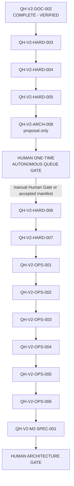

# Qwen Harness Hardening and Operations Backlog

## Purpose

This document defines the deterministic nomination order for beginner documentation,
post-Milestone 1 Hardening, an autonomous-queue Architecture proposal, Operations,
UX, and Milestone 2 review work.

It exists so a future Codex session can identify the next candidate from
Repository state without redesigning the Task. It does not grant permission to
activate or implement a Task.

## Source-of-Truth Roles

- `DECISIONS.md` Accepted ADRs define Architecture.
- Each `tasks/<TASK-ID>.md` file defines that Task's contract and records its
  planning/approval or completion status.
- `STATUS.md` owns Current/ACTIVE lifecycle, Previous Task, persisted baseline, and
  the currently nominated next Task. `qh start` changes STATUS, not the Task file.
- Interpret STATUS and the Task contract together; neither duplicates the other's role.
- This `BACKLOG.md` defines queue order, dependency policy, and Human Gates.
- Git history and objective Test/Evidence remain completion authority.

This Repository has no tracked `AGENTS.md` or `ARCHITECTURE.md`. Their absence
must not be filled with assumed policy. `PROJECT.md`, `REQUIREMENTS.md`,
`DECISIONS.md`, `STATUS.md`, Task contracts, code, tests, and Git are the
available Repository Source of Truth.

## Activation Boundary

`PLANNED` means designed and queued. It does not mean ACTIVE or implementation-approved.

**AUTONOMOUS QUEUE = NOT AUTHORIZED**

FR-004 and ADR-005, ADR-006, ADR-007, ADR-008, and ADR-010 preserve Human
lifecycle authority or explicitly defer/forbid automatic commit, completion, and
next-Task start. Therefore this queue may deterministically nominate the next
candidate, but Codex, Qwen, and automation must not:

- change a PLANNED Task to approved without Human review;
- invoke `qh start` for the candidate without explicit Human authorization;
- continue from one completed Task into the next Task in the same execution;
- treat `## Next Task` as lifecycle mutation authority.

QH-V2-DOC-002 is already COMPLETE - VERIFIED and remains the first completed queue
stage. QH-V2-HARD-003, QH-V2-HARD-004, and QH-V2-HARD-005 are the next trust-critical
Hardening sequence and must each be completed through the current Human-controlled
lifecycle. QH-V2-ARCH-008 follows those fixes, remains proposal-only, and must also
be Human-approved before start. None of these Tasks authorizes autonomous execution.

After QH-V2-ARCH-008, the separate **HUMAN ONE-TIME AUTONOMOUS QUEUE GATE** may
accept, reject, or defer a narrow policy for the exact unchanged queue and exact
Task-contract versions. Acceptance is effective only after required Requirement
clarification and an Accepted Decision are recorded and committed. Until that
happens, the state remains `AUTONOMOUS QUEUE = NOT AUTHORIZED` and ordinary
per-Task Human Gates remain mandatory.

The Gate must also record and commit every covered Task in the exact approved
pre-start form required by HARD-003. `PLANNED` contracts are not executable, and a
Supervisor may not convert them to approved contracts.

Gate approval is a decision, not unscoped write authority. Any accepted outcome
requires an exact Human-approved Gate Change Set covering Requirement/Decision
updates, pending-Task approval states, the approval manifest, Verification, and a
commit. Manifest identities are taken from that post-Gate state. A narrowly scoped
authorization-banner update may be proposed, but queue reordering or contract-authority
changes invalidate approval and require new review.

Any later policy must keep Qwen/Worker authority unchanged. A Codex CLI Supervisor
is designed by default as an optional external executor, not a Harness production
component. Harness and Qwen must remain usable without Codex. Any approved exception
applies only to the exact approval manifest and must fail
closed when the queue, an Immutable Contract Section, a non-allowlisted Task mutation,
scope, branch, remote, operation, or approval record differs.

## Global Task Rules

Every queued Task preserves these rules:

- Repository documents and Git are the Source of Truth.
- At most one Task is ACTIVE.
- Work follows Problem -> Requirements -> Architecture -> Task ->
  Implementation -> Verification.
- LLM self-report is not Evidence.
- Qwen and Worker output have no Final PASS authority.
- Deterministic Harness code owns scope, Git Evidence, Verification, and Final Gate.
- Qwen receives no general shell or Git authority.
- Architecture and Trust Boundaries do not change without a Human Gate.
- Safety and malformed state fail closed.
- Changes remain minimal and Task-scoped.
- Behavioral fixes use focused RED -> GREEN -> regression Evidence.
- Failed lifecycle operations aim for byte-for-byte zero mutation.
- `qh close` is the authoritative final Verification and lifecycle operation.
- A failure is diagnosed, fixed, and reverified inside the current Task scope.
- A later Task never justifies widening the current Task.
- Under the current Accepted Architecture, completion stops the current execution
  and does not auto-start the successor. Only a later Human-Accepted ARCH-008 policy
  may define a narrow exception for its exact immutable approval manifest.

## Deterministic Queue

Mutable lifecycle status is intentionally not duplicated in this table. Read STATUS
for Current/ACTIVE state and each Task document for its recorded planning/approval
or `COMPLETE - VERIFIED` state.

DOC-002 is shown as a completed historical prerequisite so the requested full queue
is readable; its authoritative completion record remains STATUS, its Task file, and Git.

| Order | Task | Classification source | Queue predecessor | Successor candidate |
|---:|---|---|---|---|
| 1 | QH-V2-DOC-002 | Beginner onboarding documentation stage | DOC-001 complete | QH-V2-HARD-003 |
| 2 | QH-V2-HARD-003 | ADR-010 REQUIRED-BEFORE-NEXT-MILESTONE | QH-V2-DOC-002 | QH-V2-HARD-004 |
| 3 | QH-V2-HARD-004 | Audit-derived lifecycle hardening | QH-V2-HARD-003 | QH-V2-HARD-005 |
| 4 | QH-V2-HARD-005 | Audit-derived Evidence hardening | QH-V2-HARD-004 | QH-V2-ARCH-008 |
| 5 | QH-V2-ARCH-008 | Architecture decision preparation only | QH-V2-HARD-005 | HUMAN ONE-TIME AUTONOMOUS QUEUE GATE |
| G1 | HUMAN ONE-TIME AUTONOMOUS QUEUE GATE | Human Architecture decision | QH-V2-ARCH-008 | QH-V2-HARD-006: autonomous only if accepted; otherwise ordinary Human Task Gate |
| 6 | QH-V2-HARD-006 | Audit-derived Windows scope hardening | Gate G1 plus QH-V2-HARD-005 and QH-V2-ARCH-008 | QH-V2-HARD-007 |
| 7 | QH-V2-HARD-007 | Audit-derived test-integrity hardening | QH-V2-HARD-006 | QH-V2-OPS-001 |
| 8 | QH-V2-OPS-001 | ADR-010 NEXT-HARDENING | QH-V2-HARD-007 | QH-V2-OPS-002 |
| 9 | QH-V2-OPS-002 | ADR-010 NEXT-HARDENING | QH-V2-OPS-001 | QH-V2-OPS-003 |
| 10 | QH-V2-OPS-003 | ADR-010 NEXT-HARDENING | QH-V2-OPS-002 | QH-V2-OPS-004 |
| 11 | QH-V2-OPS-004 | ADR-010 NEXT-HARDENING | QH-V2-OPS-003 | QH-V2-OPS-005 |
| 12 | QH-V2-OPS-005 | ADR-010 SAFE-TO-DEFER | QH-V2-OPS-004 | QH-V2-OPS-006 |
| 13 | QH-V2-OPS-006 | ADR-010 SAFE-TO-DEFER | QH-V2-OPS-005 | QH-V2-M2-SPEC-001 |
| 14 | QH-V2-M2-SPEC-001 | Milestone 2 review only | QH-V2-OPS-006 | HUMAN ARCHITECTURE GATE |

## Dependency Graph

## Dependency Interpretation

- QH-V2-DOC-002 is a completed historical queue stage, not a PLANNED candidate.
  Its completion must not be reverted; the first unfinished nomination is HARD-003.
- HARD-003, HARD-004, and HARD-005 remain Human-controlled and must each complete
  before ARCH-008. HARD-004 clean-lifecycle enforcement and HARD-005 final
  post-Verification Evidence refresh are trust-critical Harness prerequisites for
  unattended repetition. No temporary Supervisor compensation layer replaces them.
- ARCH-008 begins only after those three Hardening Tasks and remains proposal-only.
  No autonomous execution is enabled before or by ARCH-008 completion.
- Gate G1 is a Human Architecture decision, not a Task. Without accepted and committed
  Requirement/Decision changes, it authorizes no autonomous successor. HARD-006
  remains the next candidate but requires the ordinary per-Task Human Gate.
- HARD-003 -> HARD-004 -> HARD-005 is a strong sequence because the Tasks
  overlap `tools/qh.py` lifecycle/review behavior and later Evidence depends on
  earlier lifecycle invariants. ARCH-008 and Gate G1 follow those trust-critical
  fixes and do not add a second lifecycle or Evidence engine.
- HARD-006 and HARD-007 are technically more independent, but remain serialized
  after Gate G1 to keep the trust-hardening wave deterministic and one-Task-at-a-time.
- OPS-001 through OPS-004 follow ADR-010 priority. Several are technically
  independent; their edges are governance order, not claims of code dependency.
- OPS-005 precedes OPS-006 so current-state presentation is stabilized before
  historical Handoff material is reorganized.
- M2 review waits for the entire queue so capability proposals are evaluated
  against the hardened operating baseline.

No Task may claim HARD-004 through HARD-007 are ADR-010 requirements. They are
new, audit-derived contracts supported by current code and Repository Evidence.

## Deterministic Nomination Procedure

1. Read `STATUS.md` and stop if any Task is ACTIVE.
2. Require the current Task to be `COMPLETE - VERIFIED`.
3. Require `git status --short` to be empty.
4. Read this queue in order and inspect each Task file's recorded status.
5. Skip only Tasks whose file says `COMPLETE - VERIFIED`; this currently skips DOC-002.
6. Require every declared dependency of the first remaining Task to be complete.
7. Until an ARCH-008 policy is Human-Accepted and committed, nominate that PLANNED
   Task at the ordinary Human Task Gate.
8. Human reviews the contract, resolves open choices, and records the exact
   `APPROVED - READY FOR CONTRACT BASELINE` status.
9. Commit the approved contract baseline before an explicit `qh start`.
10. After completion, stop. A later execution repeats this procedure.

ARCH-008 may propose a conditional post-Gate procedure, but this Backlog does not
activate it. Any accepted procedure must revalidate the exact approval manifest,
one-ACTIVE invariant, predecessor completion, clean state, unchanged queue and
Immutable Contract Sections, only expected allowlisted lifecycle/status/Result/Evidence
transitions, scope, Verification, exact implementation HEAD, `qh close` Final Gate
PASS, separate lifecycle commit, and final clean state before successor eligibility.
Optional push is disabled unless the Human explicitly approves one remote/branch/refspec
and fast-forward-only behavior. Any mismatch or STOP condition ends the queue.

If queue order, scope, Architecture basis, or dependencies need revision, stop and
perform a separate Human-approved backlog-planning change. Do not silently edit
the queue inside an implementation Task.

## Human Gates

- **Task Gate:** before every PLANNED -> approved -> ACTIVE transition under the
  current Accepted Architecture. A future one-time exception requires the exact
  Human-Accepted ARCH-008 policy and immutable approval manifest.
- **One-Time Autonomous Queue Gate:** after ARCH-008. It decides whether advance
  approval may replace repeated Task/commit/close/transition decisions, which exact
  artifacts and operations are covered, and when authorization expires or is revoked.
  Gate acceptance must be recorded in Requirements/Accepted Decisions before use.
- **Design Change Gate:** whenever a Task needs a new ADR, Requirements change,
  public authority change, dependency, or Trust Boundary expansion.
- **Completion Gate:** under current policy, Human invokes `qh close` with the exact
  implementation HEAD. Delegation to a Supervisor is a specific unresolved G1 decision.
- **Milestone 2 Architecture Gate:** after QH-V2-M2-SPEC-001. No M2 implementation
  Task is created or started automatically.

## Current Nomination

QH-V2-DOC-002 is the first queue stage and is already COMPLETE - VERIFIED. The first
unfinished candidate is `QH-V2-HARD-003`; `STATUS.md` points to it as PLANNED.
Activation still requires explicit Human approval. `AUTONOMOUS QUEUE = NOT AUTHORIZED`.
