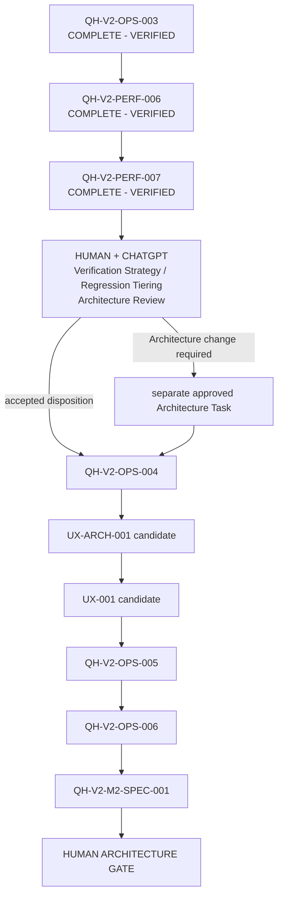

# Qwen Harness Hardening and Operations Backlog

## Purpose

이 문서는 Qwen Harness의 **현재 실행 후보 순서, dependency, Human Gate**를 정리합니다.

과거 queue와 override의 상세한 변경 이력은 Git history와 `DECISIONS.md`에 남아 있습니다.
이 파일은 2026-08-25 현재 상태를 기준으로 정리된 최신 backlog이며, 오래된
`Current Nomination` 문구를 현재 상태로 재해석하지 않습니다.

## Source-of-Truth Roles

- `DECISIONS.md`: Accepted Architecture Decision Records
- `STATUS.md`: Current Task / Previous Task / Next Planned Task / Task Baseline
- `tasks/<TASK-ID>.md`: 각 Task의 정확한 계약과 완료 Evidence
- `BACKLOG.md`: 현재 queue 후보, dependency, Human Gate
- Git history / Test Evidence: 실제 완료와 변경의 객관 근거

현재 상태가 충돌하면 `STATUS.md` 상단 lifecycle, 최신 Task contract/Evidence,
Accepted ADR, Git Evidence 순으로 확인합니다.

이 Repository에는 tracked `ARCHITECTURE.md`가 없으며 Architecture의 권위 기록은
`DECISIONS.md`입니다.

## Activation Boundary

`PLANNED` 또는 backlog에 등장한다는 사실만으로 Task 실행 권한이 생기지 않습니다.

**AUTONOMOUS QUEUE = NOT AUTHORIZED**

ADR-017의 Exception-Driven Human Supervision은 이미 승인된 Task 내부의 routine
진행에서 반복 Human relay를 줄이는 정책입니다. 다음을 허용하는 정책이 아닙니다.

- 새 Task 자동 생성/승인
- queue 자동 재우선순위
- Architecture / Requirements / Trust Boundary 자동 변경
- deterministic FAIL / BLOCKED / SAFETY 무시
- Qwen Worker의 successor 선택/시작
- unattended production queue execution

FR-004는 그대로 유지됩니다. Qwen Worker는 다음 Task를 선택하거나 시작하지 않습니다.

## Global Task Rules

모든 Task는 다음 규칙을 유지합니다.

- Repository 문서와 Git/Test Evidence가 Source of Truth입니다.
- 동시에 ACTIVE Task는 최대 하나입니다.
- Problem -> Requirements -> Architecture -> Task -> Implementation -> Verification 순서를 따릅니다.
- 이미 Repository에 정의된 단계는 불필요하게 반복하지 않습니다.
- LLM self-report는 Evidence가 아닙니다.
- Qwen/Codex의 `PASS` 주장만으로 완료하지 않습니다.
- deterministic Harness가 ChangeScope, Verification, Git Evidence, Final Gate를 소유합니다.
- Qwen에게 일반 shell/Git/Architecture/Final PASS authority를 주지 않습니다.
- behavioral change는 focused RED -> GREEN -> regression Evidence를 사용합니다.
- Verification/test를 삭제하거나 assertion을 약화해 PASS를 만들지 않습니다.
- stale/cached PASS reuse는 허용하지 않습니다.
- `qh close <exact implementation HEAD>`가 현재 authoritative final lifecycle path입니다.
- 실패한 lifecycle은 성공으로 재해석하지 않습니다.
- `CLOSED - UNSUCCESSFUL - EVIDENCE RECORDED`는 terminal이지만 PASS가 아닙니다.
- Architecture, Requirements, Trust Boundary, model/reasoning, retry/step budget, tool authority 변경은 Human Gate입니다.
- `GLOBALIZATION = NOT AUTHORIZED`를 유지합니다.

## Historical Milestones

아래 단계들은 현재 queue의 선행 Evidence입니다.

| 단계 | 결과 |
|---|---|
| HC-001 ~ HC-007 Deterministic Harness Core | COMPLETE - VERIFIED |
| Native Ollama Worker / Repository Tools / Runner / Retry / CLI / Real E2E | COMPLETE - VERIFIED |
| QH-V2-HARD-003 ~ HARD-007 trust/test hardening | COMPLETE - VERIFIED |
| QH-V2-PERF-004 Verification workflow dedup | COMPLETE - VERIFIED |
| QH-V2-ARCH-008 / former G1 policy work | historical; remaining G1 authority revoked |
| QH-V2-PERF-005 Git-heavy fixture optimization | COMPLETE - VERIFIED |
| QH-V2-OPS-001 `task-new` | COMPLETE - VERIFIED |
| QH-V2-OPS-002 `doctor` | COMPLETE - VERIFIED |
| QH-V2-HARD-008 runtime portability | COMPLETE - VERIFIED |
| QH-V2-WORKER-ROB-001 | CLOSED - UNSUCCESSFUL - EVIDENCE RECORDED |
| QH-V2-LIFECYCLE-001 unsuccessful lifecycle support | COMPLETE - VERIFIED |
| QH-V2-WORKER-DIAG-001 | COMPLETE - VERIFIED diagnosis |
| QH-V2-WORKER-ROB-002 | COMPLETE - VERIFIED experiment; Candidate A recommended |
| QH-V2-OPS-GIT-001 safe remote handoff | COMPLETE - VERIFIED |
| QH-V2-DOC-KO-001 Korean user-facing docs | COMPLETE - VERIFIED |
| QH-V2-ARCH-018 Candidate A decision | COMPLETE - VERIFIED / Accepted |
| QH-V2-WORKER-ROB-003 Candidate A production integration | COMPLETE - VERIFIED |
| QH-V2-OPS-003 Windows `qh.cmd` | COMPLETE - VERIFIED |
| QH-V2-PERF-006 close observability | COMPLETE - VERIFIED |
| QH-V2-PERF-007 new Git-heavy fixture optimization | COMPLETE - VERIFIED |

Former G1 authorization is historical/revoked Evidence only. It must not be resealed or
reused as current autonomous authority.

## Current Runtime Evidence

QH-V2-PERF-007 exact completion Evidence:

- implementation HEAD: `031dcae9beaef2db2730fbb81051fff7c3a40e79`
- lifecycle commit: `7ea2f389b7bd03858325dc38d7c72e0615653847`
- focused 14 Git-heavy tests: `551.646s -> 357.777s` (`35.15%` improvement)
- Git process starts: `284 -> 203` (`28.52%` reduction)
- final `tests.test_qh`: `1157.8s`
- full Verification: `1600.9s`
- review phase: `1613.8s`
- Final Gate: PASS

PERF-007 fixture optimization은 성공했지만 routine authoritative close practical target
`300s`를 초과했습니다.

따라서 PERF-007 contract의 runtime disposition은:

**ARCHITECTURE REVIEW REQUIRED**

입니다.

## Deterministic Queue - Current

아래 표는 2026-08-25 현재의 실행 후보 순서입니다.

| Order | Stage / Task | State | Predecessor | Successor / Gate |
|---:|---|---|---|---|
| 1 | QH-V2-OPS-003 | COMPLETE - VERIFIED | WORKER-ROB-003 | PERF-006 |
| 2 | QH-V2-PERF-006 | COMPLETE - VERIFIED | OPS-003 | PERF-007 |
| 3 | QH-V2-PERF-007 | COMPLETE - VERIFIED | PERF-006 | **Architecture Review Required** |
| G2 | HUMAN + CHATGPT Verification Strategy / Regression Tiering Architecture Review | **CURRENT GATE** | PERF-007 runtime trigger | approved Architecture Task or OPS-004 disposition |
| 4 | QH-V2-OPS-004 | BLOCKED PENDING G2 DISPOSITION | G2 resolution | UX Architecture candidate |
| 5 | UX-ARCH-001 | proposal candidate; Task contract not assumed | OPS-004 disposition | UX-001 |
| 6 | UX-001 | implementation candidate; Task contract not assumed | UX-ARCH-001 | OPS-005 |
| 7 | QH-V2-OPS-005 | existing Operations candidate | UX path disposition | OPS-006 |
| 8 | QH-V2-OPS-006 | existing Operations candidate | OPS-005 | M2-SPEC-001 |
| 9 | QH-V2-M2-SPEC-001 | Milestone 2 review candidate | OPS-006 | HUMAN ARCHITECTURE GATE |
| G3 | HUMAN ARCHITECTURE GATE | mandatory future gate | M2-SPEC-001 | no automatic successor |

`UX-ARCH-001`과 `UX-001`이 실제 Task 파일로 존재하거나 승인되었다고 이 표만으로
가정하면 안 됩니다. 필요한 경우 Human-reviewed contract creation이 먼저입니다.

## Current Dependency Graph



## Current Nomination

**Current nomination은 새 구현 Task가 아니라 Human + ChatGPT Architecture Review입니다.**

PERF-007이 300초 practical runtime trigger를 초과했으므로 `QH-V2-OPS-004`를
자동 또는 routine successor로 시작하지 않습니다.

검토 질문:

1. routine Task close에서 어느 regression을 authoritative하게 요구할 것인가?
2. repository-wide integration regression은 milestone/release/main 중 어떤 gate에서 수행할 것인가?
3. 두 계층 모두 fresh exact HEAD Evidence를 어떻게 유지할 것인가?
4. test 삭제/skip/assertion weakening/cached PASS 없이 runtime을 줄일 수 있는가?
5. task-specific Verification contract와 공통 invariant suite의 최소 안전 경계는 무엇인가?

현재 검토 후보:

```text
Task close
  -> Task-scoped focused authoritative regression
  -> common critical invariant suite
  -> exact HEAD / fresh Evidence
  -> Scope + Diff Check + Final Gate

Milestone / Release / Main Gate
  -> repository-wide integration regression
  -> exact HEAD / fresh Evidence
```

이 구조는 아직 Accepted Architecture가 아닙니다.

## Architecture Review Stop Conditions

다음 중 하나가 필요하면 별도 Human-reviewed Architecture/Requirement decision으로
분리합니다.

- `qh close` authority 변경
- Final Gate 의미 변경
- Verification coverage의 의미적 축소
- release/main gate라는 새 production authority 도입
- stale/cached PASS reuse
- new skip 또는 test 삭제
- assertion weakening
- parallel Verification 재도입
- Trust Boundary 확대
- Worker/Runner/Retry/model/tool authority 변경
- Globalization

## Human Gates

- **Task / Direction Gate**: 새 Task 생성/승인, reprioritization, ambiguous successor 선택
- **Exception Gate**: FAIL/BLOCKED/SAFETY, unresolved timeout, unexpected mutation, scope violation, Git divergence
- **Design Change Gate**: Architecture, Requirements, Trust Boundary, authority, model/reasoning, Retry/step policy
- **Completion Gate**: `qh close` deterministic Final Gate; FAIL은 LLM이 override할 수 없음
- **Current G2 Gate**: Verification Strategy / Regression Tiering Architecture Review
- **Milestone 2 Gate**: QH-V2-M2-SPEC-001 이후 Human Architecture review

## Codex Pause / Manual Operation

Codex CLI는 Harness의 필수 구성요소가 아닙니다. Codex 사용량이 부족한 동안 Human이
CMD/Git executor 역할을 맡고 ChatGPT가 설계/Review를 담당할 수 있습니다.

수동 운영 절차는 `docs/MANUAL_OPERATOR_GUIDE.md`를 사용합니다.

Architecture Review가 끝나기 전에는 다음을 실행하지 않습니다.

```text
qh.cmd start QH-V2-OPS-004
```

## Future Roadmap - Non-Executable

장기 후보:

- current Verification runtime 문제 해결
- Worker smoke/E2E standardization
- natural-language UX
- status/handoff historical cleanup
- Milestone 2 review
- future Globalization Gate
- cross-Repository Evidence-driven Harness evolution

이 항목들은 자동 실행 queue가 아닙니다.

`GLOBALIZATION = NOT AUTHORIZED`

`M3 = FUTURE / NOT AUTHORIZED`
