# Qwen Harness Hardening and Operations Backlog

## Purpose

This document defines the deterministic nomination order for beginner documentation,
post-Milestone 1 Hardening, an autonomous-queue Architecture proposal, Operations,
UX, and Milestone 2 review work.

It exists so a future Codex session can identify the next candidate from
Repository state without redesigning the Task. It does not grant permission to
activate or implement a Task.

## Source-of-Truth Roles

- `DECISIONS.md` Accepted ADRs define Architecture.
- Each `tasks/<TASK-ID>.md` file defines that Task's contract and records its
  planning/approval or completion status.
- `STATUS.md` owns Current/ACTIVE lifecycle, Previous Task, persisted baseline, and
  the currently nominated next Task. `qh start` changes STATUS, not the Task file.
- Interpret STATUS and the Task contract together; neither duplicates the other's role.
- This `BACKLOG.md` defines queue order, dependency policy, and Human Gates.
- Git history and objective Test/Evidence remain completion authority.

This Repository has no tracked `AGENTS.md` or `ARCHITECTURE.md`. Their absence
must not be filled with assumed policy. `PROJECT.md`, `REQUIREMENTS.md`,
`DECISIONS.md`, `STATUS.md`, Task contracts, code, tests, and Git are the
available Repository Source of Truth.

## Activation Boundary

`PLANNED` means designed and queued. It does not mean ACTIVE or implementation-approved.

**AUTONOMOUS QUEUE = NOT AUTHORIZED**

ADR-017 supersedes the repeated fresh-Human-prompt requirement for routine external
Human/ChatGPT/Supervisor continuation inside already-approved boundaries. FR-004
remains unchanged for Qwen: the Worker never selects or starts a successor.

`AUTONOMOUS QUEUE = NOT AUTHORIZED` still means unattended production queue automation is not authorized. An external workflow must not:

- change a PLANNED or DRAFT Task to approved without Human review;
- create or reprioritize a Task without Human review;
- continue after FAIL, BLOCKED, SAFETY, unsuccessful, or ambiguous termination;
- treat `## Next Task` alone as lifecycle mutation authority.

QH-V2-DOC-002 is already COMPLETE - VERIFIED and remains the first completed queue
stage. QH-V2-HARD-003, QH-V2-HARD-004, and QH-V2-HARD-005 form the completed
trust-critical Hardening sequence before the next Architecture proposal. After
HARD-005, QH-V2-PERF-004 is intentionally inserted as a Human-approved operational
performance Task because duplicate full Verification is already materially affecting
iteration speed. QH-V2-ARCH-008 follows PERF-004, remains proposal-only, and must
also be Human-approved before start. None of these Tasks authorizes autonomous execution.

After QH-V2-ARCH-008, the separate **HUMAN ONE-TIME AUTONOMOUS QUEUE GATE** may
accept, reject, or defer a narrow policy for the exact unchanged queue and exact
Task-contract versions. Acceptance is effective only after required Requirement
clarification and an Accepted Decision are recorded and committed. The former G1 authorization was later revoked by ADR-013 and remains historical Evidence only. `AUTONOMOUS QUEUE = NOT AUTHORIZED` continues to prohibit unattended software queue execution. ADR-017 separately governs approval cadence for external Human/ChatGPT/Supervisor continuation.

The Gate must also record and commit every covered Task in the exact approved
pre-start form required by HARD-003. `PLANNED` contracts are not executable, and a
Supervisor may not convert them to approved contracts.

Gate approval is a decision, not unscoped write authority. Any accepted outcome
requires an exact Human-approved Gate Change Set covering Requirement/Decision
updates, pending-Task approval states, the approval manifest, Verification, and a
commit. Manifest identities are taken from that post-Gate state. A narrowly scoped
authorization-banner update may be proposed, but queue reordering or contract-authority
changes invalidate approval and require new review.

Any later policy must keep Qwen/Worker authority unchanged. A Codex CLI Supervisor
is designed by default as an optional external executor, not a Harness production
component. Harness and Qwen must remain usable without Codex. Any approved exception
applies only to the exact approval manifest and must fail
closed when the queue, an Immutable Contract Section, a non-allowlisted Task mutation,
scope, branch, remote, operation, or approval record differs.

## Global Task Rules

Every queued Task preserves these rules:

- Repository documents and Git are the Source of Truth.
- At most one Task is ACTIVE.
- Work follows Problem -> Requirements -> Architecture -> Task ->
  Implementation -> Verification.
- LLM self-report is not Evidence.
- Qwen and Worker output have no Final PASS authority.
- Deterministic Harness code owns scope, Git Evidence, Verification, and Final Gate.
- Qwen receives no general shell or Git authority.
- Architecture and Trust Boundaries do not change without a Human Gate.
- Safety and malformed state fail closed.
- Changes remain minimal and Task-scoped.
- Behavioral fixes use focused RED -> GREEN -> regression Evidence.
- Failed lifecycle operations aim for byte-for-byte zero mutation.
- `qh close` is the authoritative final Verification and lifecycle operation.
- A normal implementation failure is diagnosed, fixed, and reverified inside the current Task scope unless an Accepted ADR explicitly authorizes an Evidence-backed non-success terminal disposition.
- `CLOSED - UNSUCCESSFUL - EVIDENCE RECORDED` is terminal but is never PASS, `COMPLETE - VERIFIED`, or successful dependency Evidence. ADR-015 is the authority for this state and for the one-time WORKER-ROB-001 bootstrap only.
- A later Task never justifies widening the current Task.
- Under ADR-017, an external Human/ChatGPT/Supervisor workflow may continue after successful completion without a fresh Human prompt only to an exact already-approved successor identified unambiguously by Repository Source of Truth, with dependencies satisfied and no exception condition. Qwen itself never selects or starts a successor.

## Deterministic Queue

Mutable lifecycle status is intentionally not duplicated in this table. Read STATUS
for Current/ACTIVE state and each Task document for its recorded planning/approval
or `COMPLETE - VERIFIED` state.

DOC-002 is shown as a completed historical prerequisite so the requested full queue
is readable; its authoritative completion record remains STATUS, its Task file, and Git.

| Order | Task | Classification source | Queue predecessor | Successor candidate |
|---:|---|---|---|---|
| 1 | QH-V2-DOC-002 | Beginner onboarding documentation stage | DOC-001 complete | QH-V2-HARD-003 |
| 2 | QH-V2-HARD-003 | ADR-010 REQUIRED-BEFORE-NEXT-MILESTONE | QH-V2-DOC-002 | QH-V2-HARD-004 |
| 3 | QH-V2-HARD-004 | Audit-derived lifecycle hardening | QH-V2-HARD-003 | QH-V2-HARD-005 |
| 4 | QH-V2-HARD-005 | Audit-derived Evidence hardening | QH-V2-HARD-004 | QH-V2-PERF-004 |
| 5 | QH-V2-PERF-004 | ADR-007 Verification workflow optimization | QH-V2-HARD-005 | QH-V2-ARCH-008 |
| 6 | QH-V2-ARCH-008 | Architecture decision preparation only | QH-V2-PERF-004 | HUMAN ONE-TIME AUTONOMOUS QUEUE GATE |
| G1 | HUMAN ONE-TIME AUTONOMOUS QUEUE GATE | Human Architecture decision | QH-V2-ARCH-008 | QH-V2-HARD-006: autonomous only if accepted; otherwise ordinary Human Task Gate |
| 7 | QH-V2-HARD-006 | Audit-derived Windows scope hardening | Gate G1 plus QH-V2-HARD-005 and QH-V2-ARCH-008 | QH-V2-HARD-007 |
| 8 | QH-V2-HARD-007 | Audit-derived test-integrity hardening | QH-V2-HARD-006 | QH-V2-OPS-001 |
| 9 | QH-V2-OPS-001 | ADR-010 NEXT-HARDENING | QH-V2-HARD-007 | QH-V2-OPS-002 |
| 10 | QH-V2-OPS-002 | ADR-010 NEXT-HARDENING | QH-V2-OPS-001 | QH-V2-HARD-008 |
| 11 | QH-V2-HARD-008 | ADR-014 cross-Repository runtime portability hardening | QH-V2-OPS-002 | QH-V2-WORKER-ROB-001 |
| 12 | QH-V2-WORKER-ROB-001 | ADR-014 Level B Worker protocol robustness | QH-V2-HARD-008 | QH-V2-LIFECYCLE-001 |
| 13 | QH-V2-LIFECYCLE-001 | ADR-015 Evidence-backed unsuccessful lifecycle hardening | QH-V2-WORKER-ROB-001 non-success Evidence | HUMAN SELECTION REQUIRED |
| 14 | QH-V2-OPS-003 | ADR-010 NEXT-HARDENING | Human selection after QH-V2-LIFECYCLE-001 | QH-V2-PERF-006 |
| 15 | QH-V2-PERF-006 | Human-selected close runtime/observability optimization | QH-V2-OPS-003 | QH-V2-PERF-007 |
| 16 | QH-V2-PERF-007 | Human-selected new Git-heavy fixture optimization | QH-V2-PERF-006 | QH-V2-OPS-004 or Architecture review at runtime trigger |
| 17 | QH-V2-OPS-004 | ADR-010 NEXT-HARDENING | QH-V2-PERF-007 practical-runtime disposition | QH-V2-OPS-005 |
| 18 | QH-V2-OPS-005 | ADR-010 SAFE-TO-DEFER | QH-V2-OPS-004 | QH-V2-OPS-006 |
| 19 | QH-V2-OPS-006 | ADR-010 SAFE-TO-DEFER | QH-V2-OPS-005 | QH-V2-M2-SPEC-001 |
| 20 | QH-V2-M2-SPEC-001 | Milestone 2 review only | QH-V2-OPS-006 | HUMAN ARCHITECTURE GATE |

## Dependency Graph

```mermaid
flowchart TD
    D002["QH-V2-DOC-002<br/>COMPLETE - VERIFIED"] --> H003["QH-V2-HARD-003"]
    H003 --> H004["QH-V2-HARD-004"]
    H004 --> H005["QH-V2-HARD-005"]
    H005 --> P004["QH-V2-PERF-004<br/>Verification workflow optimization"]
    P004 --> A008["QH-V2-ARCH-008<br/>proposal only"]
    A008 --> Gate1["HUMAN ONE-TIME<br/>AUTONOMOUS QUEUE GATE"]
    Gate1 -->|"manual Human Gate or accepted manifest"| H006["QH-V2-HARD-006"]
    H006 --> H007["QH-V2-HARD-007"]
    H007 --> O001["QH-V2-OPS-001"]
    O001 --> O002["QH-V2-OPS-002"]
    O002 --> H008["QH-V2-HARD-008<br/>runtime portability"]
    H008 --> WROB["QH-V2-WORKER-ROB-001<br/>closed unsuccessful; Evidence recorded"]
    WROB --> L001["QH-V2-LIFECYCLE-001<br/>unsuccessful lifecycle hardening"]
    L001 --> HumanSelect["HUMAN SELECTION REQUIRED"]
    HumanSelect --> O003["QH-V2-OPS-003<br/>only if selected"]
    O003 --> P006["QH-V2-PERF-006<br/>close observability"]
    P006 --> P007["QH-V2-PERF-007<br/>Git-heavy fixture optimization"]
    P007 --> O004["QH-V2-OPS-004"]
    O004 --> O005["QH-V2-OPS-005"]
    O005 --> O006["QH-V2-OPS-006"]
    O006 --> M2["QH-V2-M2-SPEC-001"]
    M2 --> Gate["HUMAN ARCHITECTURE GATE"]
```



## Dependency Interpretation

- QH-V2-DOC-002 is a completed historical queue stage, not a PLANNED candidate.
- HARD-003, HARD-004, and HARD-005 are COMPLETE - VERIFIED. HARD-004 clean-lifecycle
  enforcement and HARD-005 final post-Verification Evidence refresh remain
  trust-critical Harness prerequisites for unattended repetition.
- PERF-004 is a narrow ADR-007 operational optimization inserted after HARD-005. It
  changes qhops operator workflow only, keeps `qh close` authoritative, and does not
  expand Architecture or lifecycle authority.
- ARCH-008 begins only after PERF-004 and remains proposal-only. No autonomous
  execution is enabled before or by ARCH-008 completion.
- Gate G1 is a Human Architecture decision, not a Task. Without accepted and committed
  Requirement/Decision changes, it authorizes no autonomous successor. HARD-006
  remains the next candidate but requires the ordinary per-Task Human Gate.
- HARD-006 and HARD-007 are technically more independent, but remain serialized
  after Gate G1 to keep the trust-hardening wave deterministic and one-Task-at-a-time.
- ADR-014 inserts HARD-008 and WORKER-ROB-001 after OPS-002 because GitHub Issue #1
  exposed runtime portability and Worker interaction failures during a real
  cross-Repository trial.
- ADR-015 records WORKER-ROB-001 as `CLOSED - UNSUCCESSFUL - EVIDENCE RECORDED`
  after Stable and Candidate both failed the promotion threshold. This state is not
  successful completion Evidence. The one-time Human-authorized bootstrap inserts
  QH-V2-LIFECYCLE-001 next so durable non-success lifecycle support can be implemented.
  After LIFECYCLE-001 completes, Human selection is required before either a separate
  Worker investigation or resumption of OPS-003; neither path auto-starts.
- OPS-001 through OPS-004 otherwise retain ADR-010 priority. Several are technically
  independent; their edges are governance order, not claims of code dependency.
- OPS-005 precedes OPS-006 so current-state presentation is stabilized before
  historical Handoff material is reorganized.
- M2 review waits for the entire queue so capability proposals are evaluated
  against the hardened operating baseline.

No Task may claim HARD-004 through HARD-007 are ADR-010 requirements. They are
new, audit-derived contracts supported by current code and Repository Evidence.

## Deterministic Nomination Procedure

1. Read `STATUS.md` and stop if any Task is ACTIVE unless continuing that already-approved ACTIVE Task.
2. Require the current Task to be a terminal state before successor activation. `COMPLETE - VERIFIED` is successful completion. `CLOSED - UNSUCCESSFUL - EVIDENCE RECORDED` is terminal non-success and never satisfies a successful dependency.
3. Require `git status --short` to be empty where the lifecycle operation requires a clean Repository.
4. Read this queue, STATUS, and Task contracts together and identify the exact successor candidate.
5. Skip concluded Tasks, but never treat an unsuccessful terminal state as successful dependency Evidence.
6. Require every declared dependency of the successor to be satisfied.
7. If the exact successor is already `APPROVED - READY FOR CONTRACT BASELINE`, Repository Source of Truth identifies it unambiguously, and no ADR-017 exception exists, an external Human/ChatGPT/Supervisor workflow may continue without a fresh Human prompt.
8. If the successor is PLANNED or DRAFT, is ambiguous, requires a new Task, reprioritization, Candidate promotion, Architecture, Requirements, Trust Boundary, or another policy decision, stop for Human review.
9. Preserve the required Task baseline and invoke `qh start` only for the exact eligible approved successor.
10. After successful completion, re-run this procedure. Continue only while the next Task is already approved, unambiguous, dependency-valid, and exception-free.

The revoked G1 manifest remains historical Evidence only and grants no current execution authority. ADR-017 is an approval-cadence policy, not unattended production automation authority. Safe push may proceed without a fresh Human prompt only to an already-authorized remote/branch using fast-forward-only behavior; divergence, ambiguity, or destructive recovery requires Human review.

If queue order, scope, Architecture basis, dependencies, or successor authority need revision, stop for Human review. Do not silently edit the queue inside an implementation Task.

## Human Gates

- **Task / Direction Gate:** Human review is required to approve a PLANNED or DRAFT Task, create a new Task, reprioritize work, resolve ambiguous successor authority, or choose a materially different direction. An exact already-approved successor does not require a fresh Human prompt when ADR-017 normal-continuation conditions hold.
- **Exception Gate:** Human review is required for FAIL, BLOCKED, SAFETY, repeated unresolved Worker failure or timeout, unexpected mutation, scope violation, Git divergence or ambiguity, or deterministic gate failure.
- **Design Change Gate:** Human review remains mandatory for Architecture, Requirements, Trust Boundary, authority, model/reasoning policy, Retry/step policy, Candidate production promotion, or Globalization changes.
- **Completion Gate:** `qh close` remains the authoritative Final Gate. Under ADR-017, an external workflow may invoke it at the exact implementation HEAD without a fresh Human prompt when the current Task is already approved and no exception exists. Deterministic FAIL cannot be overridden.
- **Historical G1 Gate:** the former One-Time Autonomous Queue Gate is revoked and retained only as historical Evidence.
- **Milestone 2 Architecture Gate:** after QH-V2-M2-SPEC-001, mandatory Human Architecture review remains required before any Milestone 2 implementation authority.

## Current Nomination

QH-V2-PLAN-001 is the current Human-approved ACTIVE planning Task.
After it becomes COMPLETE - VERIFIED, nominate QH-V2-WORKER-DIAG-001 for a separate
Human-reviewed contract. QH-V2-WORKER-ROB-002 is conditional on diagnostic Evidence
and is not automatically required, created, approved, or started. QH-V2-OPS-003 remains
deferred until the Worker diagnostic path reaches a Human-reviewed disposition.
`AUTONOMOUS QUEUE = NOT AUTHORIZED`.

## Future Roadmap (Strategic Direction Only; Non-Executable)

This section records the long-term relationship accepted by ADR-011. It is not an
execution queue, Task contract, activation record, or implementation authorization.
It does not insert a queue node, nominate or start a Task, change a dependency, or
reorder the deterministic Queue above.

`GLOBALIZATION = NOT AUTHORIZED`

`M3 = FUTURE / NOT AUTHORIZED`

The conceptual long-term relationship is:

```text
Current Hardening / Operations
  -> future Globalization Gate
  -> Cross-Repository Evidence Phase
  -> Evidence-Driven Harness Evolution
  -> Human Architecture Gates
```

This diagram is a strategic dependency relationship, not executable queue order.
The current HARD/OPS Queue continues exactly as defined above.

### Globalization Eligibility

Before a future Globalization Gate can be considered, objective Evidence must show
the following minimum prerequisites are COMPLETE - VERIFIED:

- QH-V2-HARD-003;
- QH-V2-HARD-004;
- QH-V2-HARD-005;
- QH-V2-HARD-006;
- QH-V2-HARD-007;
- QH-V2-OPS-002 (`qh doctor`);
- QH-V2-OPS-004 (Worker Smoke / E2E Standardization).

Completion is necessary but not sufficient. It neither inserts the Globalization
Gate into the current Queue nor authorizes cross-Repository use. Exact timing, scope,
Stable version, covered Repositories, operations, and audit policy require a separate
Human Globalization Gate after Evidence review.

QH-V2-ARCH-008 only prepares a proposal. The subsequent Human One-Time Autonomous
Queue Gate may accept, reject, or defer a narrow policy for the exact queue in this
Repository. Neither ARCH-008 nor Gate G1 authorizes global or cross-Repository use;
Globalization requires its own later Human Gate.

### First Globalization Phase

If separately approved, the first phase is `GLOBAL OPTIONAL EXECUTOR`. Qwen Harness
would remain optional rather than becoming the mandatory or default executor for all
Tasks.

Future routing guidance:

- small and clear + limited scope + explicit Verification + no Architecture change
  -> possible Qwen Harness Stable candidate;
- Architecture work, large refactor, ambiguous requirements, complex debugging, or
  broad authority need -> Codex or Human Gate.

Qwen remains without general shell, Git, Architecture, or Final PASS authority.
Codex delegation does not change the Qwen Worker Trust Boundary.

### Cross-Repository Evidence Phase

After a separate Globalization approval, future work may define an Evidence schema
for Repository/Task type, language, expected and actual changed files, Worker steps,
Runner attempts, NORMAL/FAIL/BLOCKED outcome, Verification, Final Gate, duration,
failure classification, write side-effect risk, and Codex fallback.

No Evidence logging or schema is implemented by this roadmap. Schema, storage,
retention, repository identification, access, and redaction require a separate
approved Task. Credentials, secrets, and unnecessary private content must not be
collected.

### Evidence-Driven Evolution

Future Harness improvement follows:

```text
Evidence
  -> Improvement Candidate
  -> Task Contract
  -> Candidate Implementation
  -> Regression / Benchmark
  -> Promotion Gate
  -> Stable Version
```

The Harness used by actual projects remains logically Stable. A developing Candidate
must not replace or affect Stable before objective comparison and a Promotion Gate.
Codex self-assessment is not promotion Evidence. Safety regression or scope violation
makes a Candidate ineligible for automatic promotion.

- Level A improvements preserve Architecture and Trust Boundaries and may only become
  automation candidates under a future approved policy.
- Level B policy changes remain inside the existing Trust Boundary but require
  Stable-versus-Candidate benchmark Evidence.
- Level C Architecture or Trust Boundary changes require
  `Proposal -> STOP -> Human + ChatGPT Architecture Gate`, where ChatGPT supplies
  mandatory technical review and the Human retains final approval authority.

A Level C Candidate can never be promoted automatically. Even after approved
implementation and objective evaluation, Stable promotion requires an explicit Human
Promotion Gate informed by ChatGPT Architecture review.

Representative success and failure Tasks may later become a reproducible Regression
Corpus. Stable and Candidate comparison must cover safety, scope, Verification,
Final Gate, PASS/FAIL/BLOCKED behavior, Task success, and runtime/performance.

### Future Milestone 3

`Milestone 3 - Evidence-Driven Harness Evolution` is a future roadmap candidate only.
Candidate areas include Global Usage Evidence Schema, Cross-Repository Execution
Logging, Failure Pattern Classification, Improvement Candidate Generation, Harness
Regression Corpus, Stable vs Candidate Benchmark, Candidate Promotion Gate,
Evidence-Based Task Router, and Autonomous Improvement Cycle E2E.

These are not Task IDs or approved contracts. Do not generate or start a Milestone 3
implementation Task automatically. Milestone 3 remains blocked until the Milestone 2
Human Architecture Gate or another explicit Human approval.


## G1 Accepted Policy Overlay - 2026-08-22

`G1 POLICY = ACCEPTED`

This section is the later Gate decision record and supersedes earlier pre-G1
`AUTONOMOUS QUEUE = NOT AUTHORIZED` wording only for the exact manifest-bound policy
accepted by ADR-012. It does not alter the deterministic queue order above.

`AUTONOMOUS QUEUE EXECUTION = NOT ENABLED UNTIL QH-V2-GATE-001 COMPLETE - VERIFIED AND SEALED gate-check PASS`

QH-V2-GATE-001 is the Gate-materialization prerequisite outside the covered queue.
The covered queue itself remains exactly:

QH-V2-HARD-006 -> QH-V2-HARD-007 -> QH-V2-OPS-001 -> QH-V2-OPS-002 ->
QH-V2-OPS-003 -> QH-V2-OPS-004 -> QH-V2-OPS-005 -> QH-V2-OPS-006 ->
QH-V2-M2-SPEC-001 -> HUMAN ARCHITECTURE GATE.

After QH-V2-GATE-001 is COMPLETE - VERIFIED, only a manifest-guarded optional
external Codex CLI Supervisor may replace repeated Human lifecycle prompts for this
exact queue. Every delegated mutation must pass deterministic `gate-check`.
FR-004 remains unchanged for the Qwen Worker.

The approved push boundary is `origin/main`, refspec `HEAD:main`, fast-forward only.
Force push, history rewrite, Task creation, contract/queue mutation, Architecture or
Requirements mutation during covered execution, Final Gate bypass, scope expansion,
and Qwen authority expansion remain forbidden.

Any manifest, queue, immutable-section, branch, remote, lifecycle, authority-source,
scope, revocation, or approval mismatch stops execution. QH-V2-M2-SPEC-001 completion
always stops at the Human Architecture Gate; no automatic successor is authorized.

Until the materialization Task is COMPLETE - VERIFIED and the sealed manifest passes,
ordinary Human-controlled lifecycle rules remain in force.

## Post-G1 Human Override - PERF-005 Before OPS-001 - 2026-08-22

`G1 REMAINING AUTHORIZATION = REVOKED AFTER QH-V2-HARD-007`

ADR-013 records the Human decision to stop the remaining sealed G1 progression after
HARD-007 and perform one additional Evidence-driven performance round before OPS-001.
The existing G1 manifest is retained as historical Evidence only. It is not edited or
resealed, and its authority-source identities are intentionally invalidated by this
Backlog/Decision update. A later `gate-check` against that manifest must therefore stop.

For nomination after HARD-007, this later section supersedes the earlier deterministic
table and G1 overlay only where they conflict. The revised remaining order is:

```text
QH-V2-HARD-007 - COMPLETE - VERIFIED
  -> QH-V2-PERF-005
  -> QH-V2-OPS-001
  -> QH-V2-OPS-002
  -> QH-V2-OPS-003
  -> QH-V2-OPS-004
  -> QH-V2-OPS-005
  -> QH-V2-OPS-006
  -> QH-V2-M2-SPEC-001
  -> HUMAN ARCHITECTURE GATE
```

QH-V2-PERF-005 is Human-approved for contract baseline preparation and is limited to
Git-heavy test-fixture performance optimization. It does not authorize production
Harness/qh behavior changes, Verification weakening, stale PASS reuse, test deletion,
new test skipping, or Verification concurrency.

After G1 revocation, PERF-005 and the remaining OPS/M2 Tasks use the ordinary
Human-controlled Task lifecycle. No G2/resealed autonomous manifest is authorized by
this override. Any later autonomous policy requires a separate Human decision.

### Current Nomination Override

QH-V2-HARD-007, QH-V2-PERF-005, QH-V2-OPS-001, and QH-V2-OPS-002 are complete.
QH-V2-ARCH-014 is the current planning Task. After it is COMPLETE - VERIFIED,
nominate QH-V2-HARD-008 through the ordinary Human-controlled lifecycle.

## Post-OPS-002 Cross-Repository Trial Override - ADR-014 - 2026-08-23

GitHub Issue #1 is new operational Evidence and ADR-014 supersedes the earlier
post-PERF-005 remaining order only where they conflict.

`GLOBALIZATION = NOT AUTHORIZED`

The Human-controlled remaining order after QH-V2-OPS-002 is:

```text
QH-V2-OPS-002 - COMPLETE - VERIFIED
  -> QH-V2-HARD-008
  -> QH-V2-WORKER-ROB-001
  -> QH-V2-OPS-003
  -> QH-V2-OPS-004
  -> QH-V2-OPS-005
  -> QH-V2-OPS-006
  -> QH-V2-M2-SPEC-001
  -> HUMAN ARCHITECTURE GATE
```

HARD-008 is limited to runtime/import portability and diagnostics.
WORKER-ROB-001 is limited to strengthening single-tool Worker interaction while
preserving the existing deterministic SAFETY boundary. Neither Task authorizes
Globalization, automatic multi-tool execution, expanded Worker authority, or a new
autonomous queue.

### Historical Nomination Override

QH-V2-ARCH-014 was the planning Task for the ADR-014 reprioritization and this record
is historical context only. The later ADR-016 post-lifecycle override below is
authoritative for the current nomination.

## Post-Lifecycle Human Selection Override - ADR-016 - 2026-08-23

ADR-016 records the Human-selected Evidence-first path after QH-V2-LIFECYCLE-001.
It supersedes earlier post-ADR-014 queue wording only where that wording assumes
QH-V2-WORKER-ROB-001 must become successfully complete before Operations resume.

QH-V2-WORKER-ROB-001 remains `CLOSED - UNSUCCESSFUL - EVIDENCE RECORDED`.
It is never treated as successful dependency Evidence.

The Human-controlled sequence is now:

```text
QH-V2-PLAN-001
  -> QH-V2-WORKER-DIAG-001
  -> QH-V2-WORKER-ROB-002 only if diagnostic Evidence and Human review select a repair
  -> QH-V2-OPS-003
  -> QH-V2-OPS-004
  -> QH-V2-OPS-005
  -> QH-V2-OPS-006
  -> QH-V2-M2-SPEC-001
  -> HUMAN ARCHITECTURE GATE
```

QH-V2-WORKER-DIAG-001 is investigation-first and requires its own Human-approved
contract. QH-V2-WORKER-ROB-002 is conditional and has no authorization merely from
appearing in this queue. If diagnosis does not justify ROB-002, the Human may record
the diagnostic disposition and explicitly resume QH-V2-OPS-003.

No successor is automatically created or started. Worker, Runner, Retry, model,
tool, lifecycle, Verification, Final Gate, Git, Globalization, and Trust Boundary
authority remain unchanged.

## OPS-GIT-001 이후 Human 선택 순서 - 2026-08-24

QH-V2-WORKER-ROB-002와 QH-V2-DOC-003 완료 이후 Human이 Git handoff 안정화와
GitHub 문서 한국어 최신화를 먼저 수행한 뒤 Candidate A production promotion
경로로 진행하기로 선택했다. 이 섹션은 위의 과거 nomination 문구와 충돌하는
경우에만 최신 순서로 해석하며, 기존 Operations/M2 후보를 취소하지 않는다.

현재 선택된 순서:

```text
QH-V2-OPS-GIT-001
  -> QH-V2-DOC-KO-001
  -> QH-V2-ARCH-018
  -> QH-V2-WORKER-ROB-003
  -> QH-V2-OPS-003
  -> QH-V2-OPS-004
  -> UX-ARCH-001
  -> UX-001
  -> QH-V2-OPS-005
  -> QH-V2-OPS-006
  -> QH-V2-M2-SPEC-001
  -> HUMAN ARCHITECTURE GATE
```

`QH-V2-OPS-GIT-001`은 exact baseline에서 만든 하나의 `atomic handoff` commit과
read-only `qh handoff-check`를 사용해 `FAST_FORWARD_SAFE`일 때만 사람이
`git merge --ff-only`로 적용하는 운영 경로를 구현한다. multi-commit range
`cherry-pick`은 일상 handoff 정상 경로에서 사용하지 않는다.

`QH-V2-DOC-KO-001`은 GitHub 사용자-facing 문서를 한국어로 통일하고 현재 상태로
최신화하는 별도 문서 Task다. `QH-V2-ARCH-018`은 Candidate A production promotion
결정을 기록하며, 실제 Worker production integration은 `QH-V2-WORKER-ROB-003`에서
별도 수행한다.

2026-08-25 Human Architecture Gate는 ADR-018로 Candidate A - Deterministic Worker
Brief를 Accepted했다. original tracked Task가 유일한 Source of Truth이며 Brief는
required section의 deterministic exact projection이다. Candidate B one-step
instruction은 채택하지 않는다. `qwen3:8b`, `think:false`, timeout `30.0`, current
Worker step budget, Retry policy, tool schema/authority, FR-004, Verification, Final
Gate, lifecycle, Git authority는 그대로 유지한다.

`QH-V2-WORKER-ROB-003`은 `QH-V2-ARCH-018`이 `COMPLETE - VERIFIED`에 도달한 뒤에만
별도 contract로 시작할 수 있다. 이 Architecture 결정 자체는 production runtime을
변경하거나 successor를 자동 시작하지 않는다.

`GLOBALIZATION = NOT AUTHORIZED`

## Post-PERF-006 Human Performance Selection - 2026-08-25

PERF-006의 exact close timing과 후속 read-only 병목 분석에 따라 신규 Git-heavy
fixture 최적화를 OPS-004보다 먼저 수행한다.

```text
QH-V2-PERF-006 - COMPLETE - VERIFIED
  -> QH-V2-PERF-007
  -> QH-V2-OPS-004 only if the practical-runtime disposition permits
```

QH-V2-PERF-007은 `QhUnsuccessfulLifecycleTests`와 `HandoffCheckTests`의 independent
seed/scenario-copy fixture만 최적화한다. production qh/Harness, real Git/qh semantics,
Verification coverage와 Final Gate는 변경하지 않는다. 최종 `tests.test_qh` 또는
authoritative close가 300초를 넘으면 OPS-004를 시작하지 않고 Verification Strategy
Architecture review를 요청한다.

`GLOBALIZATION = NOT AUTHORIZED`

## Post-OPS-003 Human Performance Selection - 2026-08-25

QH-V2-OPS-003의 tracked Follow-up Observation과 Human 선택에 따라 authoritative
close runtime/observability 개선을 OPS-004보다 먼저 수행한다.

```text
QH-V2-OPS-003 - COMPLETE - VERIFIED
  -> QH-V2-PERF-006
  -> QH-V2-OPS-004
```

QH-V2-PERF-006은 Verification coverage나 Final Gate를 줄이지 않고 current command,
elapsed heartbeat, completion exit status와 close phase를 표시한다. `qh close`는 exact
implementation HEAD에서 전체 Verification을 한 번 실행하는 authoritative final path로
유지된다. 이 순서 변경은 Worker successor 선택, unattended queue 또는 Globalization을
승인하지 않는다.

`GLOBALIZATION = NOT AUTHORIZED`
