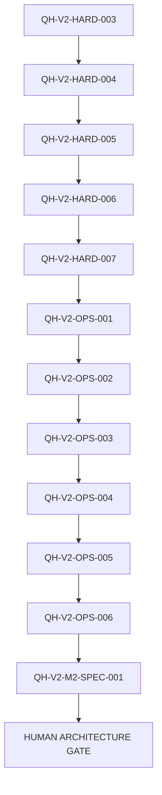

# Qwen Harness Hardening and Operations Backlog

## Purpose

This document defines the deterministic nomination order for post-Milestone 1
Hardening, Operations, UX, and Milestone 2 review work.

It exists so a future Codex session can identify the next candidate from
Repository state without redesigning the Task. It does not grant permission to
activate or implement a Task.

## Source-of-Truth Roles

- `DECISIONS.md` Accepted ADRs define Architecture.
- Each `tasks/<TASK-ID>.md` file defines that Task's contract and records its
  planning/approval or completion status.
- `STATUS.md` owns Current/ACTIVE lifecycle, Previous Task, persisted baseline, and
  the currently nominated next Task. `qh start` changes STATUS, not the Task file.
- Interpret STATUS and the Task contract together; neither duplicates the other's role.
- This `BACKLOG.md` defines queue order, dependency policy, and Human Gates.
- Git history and objective Test/Evidence remain completion authority.

This Repository has no tracked `AGENTS.md` or `ARCHITECTURE.md`. Their absence
must not be filled with assumed policy. `PROJECT.md`, `REQUIREMENTS.md`,
`DECISIONS.md`, `STATUS.md`, Task contracts, code, tests, and Git are the
available Repository Source of Truth.

## Activation Boundary

`PLANNED` means designed and queued. It does not mean ACTIVE or implementation-approved.

FR-004 and ADR-005, ADR-006, and ADR-010 prohibit automatic next-Task start and
require a Human Gate for every implementation Task. Therefore this queue may
deterministically nominate the next candidate, but Codex, Qwen, and automation
must not:

- change a PLANNED Task to approved without Human review;
- invoke `qh start` for the candidate without explicit Human authorization;
- continue from one completed Task into the next Task in the same execution;
- treat `## Next Task` as lifecycle mutation authority.

Allowing unattended automatic activation would require a separate Human-approved
Architecture decision and is outside this Backlog.

## Global Task Rules

Every queued Task preserves these rules:

- Repository documents and Git are the Source of Truth.
- At most one Task is ACTIVE.
- Work follows Problem -> Requirements -> Architecture -> Task ->
  Implementation -> Verification.
- LLM self-report is not Evidence.
- Qwen and Worker output have no Final PASS authority.
- Deterministic Harness code owns scope, Git Evidence, Verification, and Final Gate.
- Qwen receives no general shell or Git authority.
- Architecture and Trust Boundaries do not change without a Human Gate.
- Safety and malformed state fail closed.
- Changes remain minimal and Task-scoped.
- Behavioral fixes use focused RED -> GREEN -> regression Evidence.
- Failed lifecycle operations aim for byte-for-byte zero mutation.
- `qh close` is the authoritative final Verification and lifecycle operation.
- A failure is diagnosed, fixed, and reverified inside the current Task scope.
- A later Task never justifies widening the current Task.
- Completion stops the current execution; it does not auto-start the successor.

## Deterministic Queue

Mutable lifecycle status is intentionally not duplicated in this table. Read STATUS
for Current/ACTIVE state and each Task document for its recorded planning/approval
or `COMPLETE - VERIFIED` state.

| Order | Task | Classification source | Queue predecessor | Successor candidate |
|---:|---|---|---|---|
| 1 | QH-V2-HARD-003 | ADR-010 REQUIRED-BEFORE-NEXT-MILESTONE | HARD-002 complete | QH-V2-HARD-004 |
| 2 | QH-V2-HARD-004 | Audit-derived lifecycle hardening | QH-V2-HARD-003 | QH-V2-HARD-005 |
| 3 | QH-V2-HARD-005 | Audit-derived Evidence hardening | QH-V2-HARD-004 | QH-V2-HARD-006 |
| 4 | QH-V2-HARD-006 | Audit-derived Windows scope hardening | QH-V2-HARD-005 | QH-V2-HARD-007 |
| 5 | QH-V2-HARD-007 | Audit-derived test-integrity hardening | QH-V2-HARD-006 | QH-V2-OPS-001 |
| 6 | QH-V2-OPS-001 | ADR-010 NEXT-HARDENING | QH-V2-HARD-007 | QH-V2-OPS-002 |
| 7 | QH-V2-OPS-002 | ADR-010 NEXT-HARDENING | QH-V2-OPS-001 | QH-V2-OPS-003 |
| 8 | QH-V2-OPS-003 | ADR-010 NEXT-HARDENING | QH-V2-OPS-002 | QH-V2-OPS-004 |
| 9 | QH-V2-OPS-004 | ADR-010 NEXT-HARDENING | QH-V2-OPS-003 | QH-V2-OPS-005 |
| 10 | QH-V2-OPS-005 | ADR-010 SAFE-TO-DEFER | QH-V2-OPS-004 | QH-V2-OPS-006 |
| 11 | QH-V2-OPS-006 | ADR-010 SAFE-TO-DEFER | QH-V2-OPS-005 | QH-V2-M2-SPEC-001 |
| 12 | QH-V2-M2-SPEC-001 | Milestone 2 review only | QH-V2-OPS-006 | HUMAN ARCHITECTURE GATE |

## Dependency Graph

## Dependency Interpretation

- HARD-003 -> HARD-004 -> HARD-005 is a strong sequence because the Tasks
  overlap `tools/qh.py` lifecycle/review behavior and later Evidence depends on
  earlier lifecycle invariants.
- HARD-006 and HARD-007 are technically more independent, but remain serialized
  to keep the trust-hardening wave deterministic and one-Task-at-a-time.
- OPS-001 through OPS-004 follow ADR-010 priority. Several are technically
  independent; their edges are governance order, not claims of code dependency.
- OPS-005 precedes OPS-006 so current-state presentation is stabilized before
  historical Handoff material is reorganized.
- M2 review waits for the entire queue so capability proposals are evaluated
  against the hardened operating baseline.

No Task may claim HARD-004 through HARD-007 are ADR-010 requirements. They are
new, audit-derived contracts supported by current code and Repository Evidence.

## Deterministic Nomination Procedure

1. Read `STATUS.md` and stop if any Task is ACTIVE.
2. Require the current Task to be `COMPLETE - VERIFIED`.
3. Require `git status --short` to be empty.
4. Read this queue in order and inspect each Task file's recorded status.
5. Skip only Tasks whose file says `COMPLETE - VERIFIED`.
6. Require every declared dependency of the first remaining Task to be complete.
7. Nominate that PLANNED Task at the Human Task Gate.
8. Human reviews the contract, resolves open choices, and records the exact
   `APPROVED - READY FOR CONTRACT BASELINE` status.
9. Commit the approved contract baseline before an explicit `qh start`.
10. After completion, stop. A later execution repeats this procedure.

If queue order, scope, Architecture basis, or dependencies need revision, stop and
perform a separate Human-approved backlog-planning change. Do not silently edit
the queue inside an implementation Task.

## Human Gates

- **Task Gate:** before every PLANNED -> approved -> ACTIVE transition.
- **Design Change Gate:** whenever a Task needs a new ADR, Requirements change,
  public authority change, dependency, or Trust Boundary expansion.
- **Completion Gate:** Human invokes `qh close` with the exact implementation HEAD.
- **Milestone 2 Architecture Gate:** after QH-V2-M2-SPEC-001. No M2 implementation
  Task is created or started automatically.

## Current Nomination

The first queue candidate is `QH-V2-HARD-003`. `STATUS.md` may point to it as
PLANNED, but activation still requires explicit Human approval.
