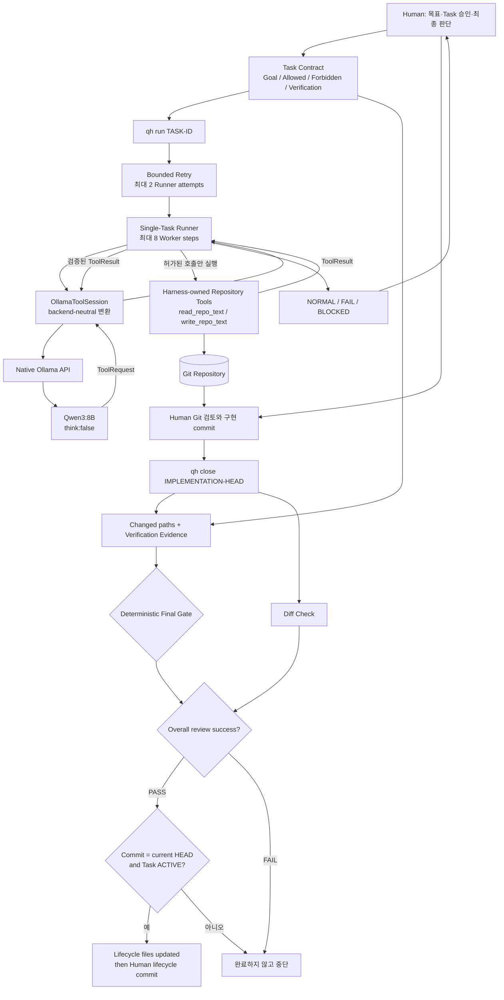
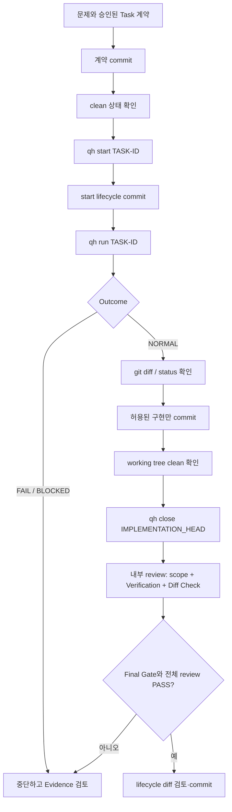

# Qwen Harness

로컬 Qwen LLM을 단순한 코드 생성기가 아니라, **Task Scope, 제한된 Tool 권한,
Git Evidence, Verification, Final Gate로 통제되는 검증 가능한 Coding Worker**로
사용하기 위한 로컬 우선(local-first) Harness입니다.

> 핵심 원칙: **LLM self-report != Evidence**

Qwen이 “수정했습니다” 또는 “테스트를 통과했습니다”라고 말하는 것만으로는
작업이 완료되지 않습니다. 실제 변경 경로와 테스트 종료 코드 등 기계적으로
확인 가능한 Evidence가 Final Gate를 통과해야 합니다.

## 처음이라면 여기부터

원하는 목적에 맞는 문서부터 읽으세요.

| 나는 무엇을 하고 싶나요? | 먼저 볼 문서 |
|---|---|
| 처음 설치하고 작은 예제를 실행하고 싶다 | [처음 사용하는 사용자 → Quick Start](docs/QUICKSTART.md) |
| Qwen, Ollama, Harness의 관계를 이해하고 싶다 | [구조를 이해하고 싶은 사용자 → How It Works](docs/HOW_IT_WORKS.md) |
| 이 Repository를 계속 개발하고 싶다 | [Repository를 개발하려는 사용자 → Development Guide](docs/DEVELOPMENT.md) |

## Tested Hardware / 실제로 검증된 실행 환경

아래 사양은 **최소 사양이 아닙니다**. 이 Repository의 실제 Worker E2E가
성공한 한 가지 검증 환경입니다.

| 항목 | 실제 검증 환경 |
|---|---|
| 운영체제 | Windows |
| GPU | NVIDIA RTX 5070 Laptop GPU |
| VRAM | VRAM 8 GB |
| System RAM | System RAM 32 GB |
| 로컬 모델 런타임 | Ollama |
| 모델 | `qwen3:8b` |
| 검증 결과 | 실제 Repository Worker E2E 성공 |
| 실행 중 관찰 | CPU/GPU 혼합 사용 확인 |

8 GB VRAM은 최소 VRAM 또는 최소 사양이라는 뜻이 아닙니다. 이 프로젝트는
아직 최소 VRAM 수치를 정할 만큼 여러 하드웨어를 공식 검증하지 않았습니다.

| 환경 구분 | 현재 상태 | 의미 |
|---|---|---|
| 위 표의 단일 환경 | 실제 검증됨 | 해당 환경에서 실제 Worker E2E가 성공했습니다. |
| 다른 GPU 또는 VRAM 구성 | 미검증 | 동작 여부와 속도는 GPU·VRAM과 환경에 따라 다릅니다. |
| CPU/System RAM 함께 사용 | 가능성 있음 | Ollama의 모델 배치와 환경에 따라 함께 사용할 수 있고 검증 환경에서도 혼합 사용을 관찰했지만, offload 비율이나 동작을 보장하지 않습니다. |
| CPU-only 환경 | 미검증 | 완전 지원 또는 실용적인 속도를 판단할 Repository Evidence가 없습니다. |
| Linux/macOS | 전체 E2E 미검증 | Python 코드가 실행될 가능성과 공식 E2E 지원은 다른 주장입니다. |
| 실행 성능 | 환경 의존 | GPU·VRAM·RAM, 전원·발열 상태와 Ollama/model 상태에 따라 달라질 수 있으며 공식 성능 보장은 없습니다. |

## 처음 사용하는 사람을 위한 5분 시작

아래는 설치 상태를 빠르게 확인하는 짧은 명령 경로입니다. 명령 입력과 확인은
간단하지만 `ollama pull`의 모델 다운로드는 네트워크와 저장장치에 따라
5분보다 오래 걸릴 수 있습니다.

```powershell
git clone https://github.com/tmdgns104/qwen-harness-test.git
```

Repository와 전체 Git 이력을 내려받으며, 정상이면 `qwen-harness-test` 폴더가 생깁니다.

```powershell
cd qwen-harness-test
```

명령 실행 위치를 Repository root로 옮기며, 정상이라면 현재 폴더가 `qwen-harness-test`입니다.

```powershell
python --version
```

Python 설치를 확인하며, 정상이면 버전이 출력되고 현재 소스에는 Python 3.12 이상이 필요합니다.

```powershell
git --version
```

Git 설치를 확인하며, 정상이면 설치된 Git 버전이 출력됩니다.

```powershell
ollama --version
```

Ollama CLI 설치를 확인하며, 정상이면 설치된 Ollama 버전이 출력됩니다.

```powershell
ollama pull qwen3:8b
```

기본 Qwen 모델을 로컬에 내려받으며, 정상이면 오류 없이 다운로드가 완료됩니다.

```powershell
ollama list
```

로컬 모델 목록을 확인하며, 정상이면 출력에 `qwen3:8b`가 보입니다.

```powershell
python tools\qh.py status
```

현재 Task 파일·Git 변경 경로·scope를 보여 주며, 정상 출력이어도 clean 여부는 별도로 확인해야 합니다.

```powershell
python tools\qh.py preflight
```

Repository root·현재 Task 파일 존재·Allowed/Forbidden scope 형식을 확인하며,
정상이라면 오류 없이 해당 정보와 Git State가 출력됩니다.

## 설치 성공 확인

다음 항목을 모두 직접 확인하세요.

- `python --version`, `git --version`, `ollama --version`이 각각 버전을 출력합니다.
- `ollama list`에 `qwen3:8b`가 있습니다.
- `python tools\qh.py status`와 `preflight`에 `ERROR`가 없고, 새 clone이라면
  출력된 Git State가 clean인지 확인합니다.
- `status`와 `preflight`는 dirty 상태에서도 exit code 0일 수 있으므로 출력도 읽습니다.

여기까지는 Repository와 Task 계약 형식을 확인한 것입니다. `status`와
`preflight`는 Ollama에 요청하지 않으며 Qwen 추론, 실제 Worker E2E 또는 Task
완료를 증명하지 않습니다. 실제 첫 Worker 흐름은 [Quick Start의 QH-LOCAL-001 예제](docs/QUICKSTART.md#5-작은-task-계약-만들기)를 따라 하세요.

## 첫 Task를 이해하기

Qwen Harness의 첫 작업은 채팅 한 줄이 아니라 Human이 먼저 읽고 승인하는
Task 계약에서 시작합니다.

| 용어 | 아주 쉽게 말하면 |
|---|---|
| **Task** | Qwen에게 주는 작업 지시서입니다. 목표, 수정 범위, 검증 방법을 한 파일에 적습니다. |
| **Allowed Changes** | Qwen이 수정해도 되는 파일이나 경로입니다. |
| **Forbidden Changes** | 절대 수정하면 안 되는 파일이나 경로이며 Allowed보다 우선합니다. |
| **Verification** | 작업이 정말 성공했는지 확인하기 위해 Harness가 실제로 실행하는 명령입니다. |
| **Final Gate** | Qwen의 말이 아니라 Git·Verification Evidence를 보고 PASS/FAIL을 결정하는 마지막 검사입니다. |
| **Git commit** | 선택한 현재 변경 상태를 Git 이력에 남겨 되돌아갈 수 있게 만드는 체크포인트입니다. |

처음에는 Quick Start 문서에 적힌 `QH-LOCAL-001` 학습용 Task 계약을 직접
만들어 그대로 따라 해보는 것을 권장합니다. Repository에 미리 생성된 예제
Task 파일이 있는 것은 아닙니다.

## 왜 만들었나요?

LLM은 코드를 잘 제안할 수 있지만 다음과 같은 실수를 할 수 있습니다.

- 허용하지 않은 파일까지 수정한다.
- 실제로 실행하지 않은 테스트를 통과했다고 말한다.
- 일부 Verification 명령만 실행하고 전체 검증이 끝났다고 판단한다.
- 실패 후 같은 작업을 무한히 반복하거나, 이미 파일을 쓴 상태에서 위험하게 재시도한다.

Qwen Harness는 이 문제를 프롬프트만으로 해결하지 않습니다. 사람과 모델 사이에
결정론적 Python Harness를 두고 다음 근거를 조합합니다.

```text
Task Contract
+ Scoped Tool Authority
+ Git Evidence
+ Test / Command Evidence
+ Deterministic Final Gate
```

## 전체 흐름



`qh run`과 완료 판정은 분리되어 있습니다. Worker 대화가 `NORMAL`로 끝나도
Repository Task가 PASS한 것은 아닙니다. `review`/`close`가 Git 변경 범위와
Verification 결과를 평가한 뒤에야 Final Gate 결과가 나옵니다.

## Human, Harness, Qwen의 역할

| 주체 | 담당하는 일 | 담당하지 않는 일 |
|---|---|---|
| Human | 문제 정의, Task/Architecture 승인, 커밋과 최종 수용 | LLM 자기 보고를 Evidence로 대신하지 않음 |
| Harness | Tool 허가, Task scope 검사, Git/Verification Evidence, retry와 Final Gate | 제품 목표나 Architecture를 임의로 결정하지 않음 |
| Qwen | 승인된 작은 Task 이해, 코드 수정 제안, Tool Call 요청 | shell 권한, 최종 PASS, scope 또는 retry 예산 결정 |
| Ollama | 로컬에서 모델을 제공하고 `/api/chat` 요청을 전달 | Repository 안전 정책이나 완료 판정 |

## 주요 개념

- **Harness**: Qwen의 요청과 Repository 사이에서 규칙을 강제하는 Python 코드입니다.
- **Worker**: 현재 Task를 받아 의미 판단과 구현을 시도하는 로컬 모델 실행 경로입니다.
- **Adapter**: Ollama 고유 응답을 backend-neutral `WorkerStep`/`ToolRequest`로 변환합니다.
- **Runner**: 한 번에 0개 또는 1개의 ToolRequest만 허용하고 최대 8 step으로 실행을 제한합니다.
- **Retry**: 쓰기 전 transient Worker 실패만 최대 한 번 더 시도합니다. 총 Runner attempt는 2회입니다.
- **Repository Tools**: 현재 Worker에게 제공되는 도구는 `read_repo_text`와 `write_repo_text`뿐입니다.
- **ChangeScope**: 정확한 경로 또는 끝이 `/**`인 재귀 경로만 지원합니다. Forbidden이 항상 우선하며 기본값은 거부입니다.
- **Verification Contract**: Task의 `Run exactly:`, `Run:`, `Then run:` marker가 각각 정확히 한 명령을 허가합니다.
- **Evidence**: baseline 이후 변경 경로, scope 판정, 실제 명령과 exit code 같은 객관적 사실입니다.
- **Final Gate**: Evidence를 다시 평가해 결정론적 PASS/FAIL을 반환합니다.

읽기는 Repository root 밖으로 나갈 수 없지만 Task의 Allowed/Forbidden 쓰기
범위로 필터링되지는 않습니다. 쓰기는 scope 검사를 거치며, Runner는
`STATUS.md`와 현재 Task 계약 파일을 별도로 보호합니다.

## 현재 구현된 기능

다음 항목은 현재 코드, 테스트, 완료 Task 및 Git 이력으로 확인됩니다.

- backend-neutral Worker/Tool 계약
- native Ollama API + 기본 모델 `qwen3:8b` Worker
- `think:false` Tool Call 세션과 ToolResult continuation
- Repository 내부 UTF-8 읽기: `read_repo_text`
- Task scope가 허용한 UTF-8 쓰기: `write_repo_text`
- exact path와 trailing `/**` scope, Forbidden 우선, default deny
- Core의 clean-working-tree baseline 검사와 persisted Task HEAD baseline,
  baseline 이후 changed-path Evidence
- Verification Contract 파싱과 `shell=False` 명령 실행
- marker 없는 독립 command/fenced block의 fail-closed 처리
- exact-content 및 SHA-256 Core 검사 함수
- Evidence 조립과 deterministic Final Gate
- 최대 8 Worker step의 Single-Task Runner
- 최대 2 attempt의 bounded retry와 `NORMAL`/`FAIL`/`BLOCKED` 결과
- `status`, `preflight`, `verify`, `review`, `start`, `run`, `close` CLI
- 실제 Ollama + Qwen3:8B Repository 편집 E2E 완료

주의: exact-content/SHA-256 함수는 Harness Core에 구현되어 있지만 현재
`qh review`가 Task Markdown에서 invariant를 자동 추출해 연결하지는 않습니다.
필요한 invariant는 현재 Task의 명시적 Verification 명령으로 검증합니다.

## Planned / Future

다음 항목은 현재 구현 완료로 간주하면 안 됩니다.

- 같은 ACTIVE Task를 다시 `qh start`하지 못하게 하는 lifecycle guard
- Human-approved Task scaffold 생성
- 읽기 전용 환경 진단 명령 `qh doctor`
- Windows 명령 workflow 단순화
- 재사용 가능한 Worker smoke/E2E 표준화
- 추가 Worker backend와 모델 benchmark
- ECC 기반 routing/skill/context 관리
- 자동 Codex escalation
- LangGraph orchestration 또는 multi-agent 확장

첫 번째 항목은 ADR-010에서 다음 capability milestone 전에 필요한 hardening으로
분류되어 있습니다. 이 README는 해당 기능을 구현하지 않습니다.

## 소프트웨어 요구사항과 지원 범위

현재 저장소에는 별도 Python package dependency가 없으며 실행 코드는 Python
표준 라이브러리를 사용합니다.

- **운영체제**: 실제 검증 환경은 Windows입니다. 다른 OS의 전체 E2E는 공식 검증되지 않았습니다.
- **Python 3.12+**: 현재 CLI 문법 기준이며, 이번 공개 준비 검증 환경은 Python 3.13.5입니다.
- **Git**
- **Ollama**
- **Qwen 모델**: 기본값 `qwen3:8b`

프로젝트가 특정 Git/Ollama 최소 버전이나 하드웨어 최소 사양을 고정하지는
않습니다. 하드웨어 Evidence와 미검증 범위는 위의
[실제로 검증된 실행 환경](#tested-hardware--실제로-검증된-실행-환경)을 확인하세요.

## 다음 단계: 실제 Task 실행

`qh`는 Task를 자동으로 만들어 주지 않습니다. 먼저 `tasks/<TASK-ID>.md`에
Goal, Allowed Changes, Forbidden Changes, Verification이 있는 승인된 Task 계약을
작성해야 합니다. 계약 commit, start 전환, Worker 실행, 구현 commit, close와
lifecycle commit까지 이어지는 전체 절차는 [Quick Start](docs/QUICKSTART.md)를
따르세요. 위의 5분 시작만으로는 Qwen Worker를 실행한 것이 아닙니다.

## qh CLI

| 명령 | 목적 | 성공과 실패의 의미 |
|---|---|---|
| `python tools\qh.py status` | 현재 Task, 현재 HEAD 대비 dirty 경로, scope를 표시 | exit 0이 clean을 보장하지 않으므로 출력도 확인 |
| `python tools\qh.py preflight` | 현재 Task 파일과 scope 형식을 확인 | dirty 상태를 보고만 하며 그 자체로 실패시키지 않음 |
| `python tools\qh.py verify` | 현재 Task의 명시적 Verification 명령만 실행 | 모든 명령 exit 0일 때 성공; scope/Final Gate 검사는 아님 |
| `python tools\qh.py review [BASELINE-COMMIT]` | baseline 이후 변경 경로, Verification, scope, Final Gate를 평가 | `Unexpected Changed Paths: no`, `Diff Check: exit 0`, `Final Gate: PASS`를 직접 확인 |
| `python tools\qh.py start <TASK-ID>` | 이미 존재하는 Task를 Current Task로 전환하고 HEAD를 baseline으로 기록 | Task를 생성/승인/커밋하지 않음; 같은 ACTIVE Task에 반복 실행하지 말 것 |
| `python tools\qh.py run <TASK-ID>` | bounded retry를 통해 Worker interaction 실행 | `NORMAL`은 대화 종료일 뿐 Repository PASS가 아님; `FAIL`/`BLOCKED`면 중단 |
| `python tools\qh.py close <COMMIT>` | review PASS 후 현재 HEAD commit으로 Task lifecycle을 완료 처리 | lifecycle 파일을 수정하지만 자동 commit하지 않음 |

실제 parser가 지원하는 명령은 [tools/qh.py](tools/qh.py)에서 확인할 수 있습니다.

## 실제 Task 작업 흐름



안전한 순서는 다음과 같습니다.

1. 한 가지 Goal을 가진 작은 Task 계약을 작성하고 검토합니다.
2. Task 계약을 커밋하고 working tree가 clean인지 확인합니다.
3. `qh start <TASK-ID>` 후 `STATUS.md` 전환을 별도 커밋합니다.
4. `qh run <TASK-ID>`을 실행합니다.
5. `git diff`와 `git status --short`로 결과를 검토합니다. 문제 진단이
   필요할 때만 `qh verify` 또는 `qh review`를 중간 실행합니다.
6. 허용된 구현만 커밋하고 다시 clean인지 확인합니다.
7. 방금 만든 구현 HEAD로 `qh close <COMMIT>`을 실행합니다.
8. close가 만든 `STATUS.md`와 Task 상태 변경을 별도 커밋합니다.

ADR-007의 표준 final path는 `qh close` 안에서 full Verification과 review를
한 번 실행합니다. standalone `verify`/`review`는 진단용이며 필수 선행 단계가
아닙니다.

## Safety / Trust Model

- Qwen은 최종 PASS 권한이 없습니다.
- Worker에게 일반 shell 또는 Git 권한을 주지 않습니다.
- LLM 요청 자체는 Tool 실행 권한이 아닙니다.
- 쓰기는 Task Allowed/Forbidden scope를 통과해야 합니다.
- Forbidden 경로가 Allowed보다 우선합니다.
- 절대 경로, `..` 탈출, lifecycle-control 파일 쓰기는 Runner가 거부합니다.
- 한 Worker step의 다중/잘못된/알 수 없는 ToolRequest는 fail closed됩니다.
- Verification marker 하나는 명령 하나만 허가합니다.
- marker 없는 독립 inline command와 fenced command block은 fail closed됩니다.
- Verification 명령은 shell 없이 실행되고 `&&`, `||`, `|`, `;` 제어 연산자는 거부됩니다.
- 쓰기 시도 뒤의 transient 실패는 전체 Runner를 자동 재시도하지 않고 `BLOCKED`로 멈춥니다.
- LLM 출력은 deterministic FAIL Evidence를 덮어쓸 수 없습니다.

## 현재 프로젝트 상태

- Milestone 1 실제 Worker E2E: **COMPLETE - VERIFIED**
- Verification fail-closed hardening(QH-V2-HARD-002): **COMPLETE - VERIFIED**
- GitHub 문서화/공개 준비: QH-V2-DOC-001로 추적
- 초보자 온보딩과 실제 검증 Hardware 안내: QH-V2-DOC-002로 추적
- 다음 필수 hardening 후보: same-active `qh start` lifecycle guard
- 해당 guard가 완료되기 전 capability expansion은 ADR-010에 따라 보류
- 다음 계획 후보: QH-V2-HARD-003 - PLANNED - Human approval required
- 알려진 기존 RED fixture: 미수행 QH-V2-MD-001 때문에
  `tests/test_markdown_append.py` 3개가 전체 discovery에서 실패하며,
  현재 Harness hardening의 regression은 아닙니다.

운영 상태의 최신 값은 항상 [STATUS.md](STATUS.md)를 우선합니다. STATUS의
Handoff는 누적 이력이므로 상단 Current/Previous/Next Planned 줄과 최신 완료
Task/Git Evidence를 함께 확인하세요.

## 문서와 Source of Truth

- [PROJECT.md](PROJECT.md) — 프로젝트 목적과 Milestone 1 경계
- [REQUIREMENTS.md](REQUIREMENTS.md) — 기능·검증 요구사항
- [DECISIONS.md](DECISIONS.md) — Accepted Architecture Decision Records
- [STATUS.md](STATUS.md) — 현재 Task와 handoff 상태
- [BACKLOG.md](BACKLOG.md) — Hardening/Operations 후보 순서와 Human Gate
- [tasks/](tasks/) — Task 계약과 완료 Evidence
- [Quick Start](docs/QUICKSTART.md) — 처음 실행하는 순서
- [How It Works](docs/HOW_IT_WORKS.md) — 내부 구조와 신뢰 모델
- [Development Guide](docs/DEVELOPMENT.md) — Repository 개발 규칙
- [Verified Problem Resolutions](docs/verified_problem_resolutions.md) — 검증된 운영 문제와 해결 기록

현재 Repository에는 별도의 `ARCHITECTURE.md`와 `AGENTS.md`가 없습니다.
Architecture의 현재 권위 있는 기록은 `DECISIONS.md`의 Accepted ADR입니다.

## 공개 전 참고

이 Repository에는 현재 `LICENSE` 파일이 없습니다. 공개 열람은 가능하지만,
제3자 재사용 조건을 명확히 하려면 별도의 Human 결정과 라이선스 추가 Task가
필요합니다.
