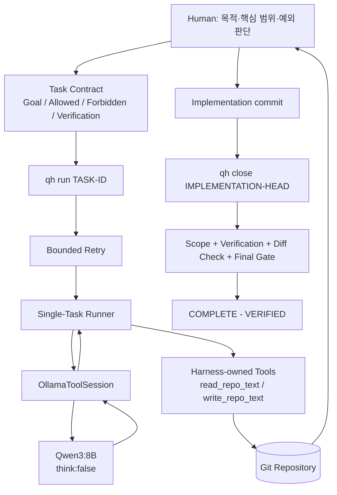

# Qwen Harness

로컬 Qwen LLM을 단순한 코드 생성기가 아니라, **Task Scope, 제한된 Tool 권한,
Git Evidence, Verification, Final Gate로 통제되는 검증 가능한 Coding Worker**로
사용하기 위한 local-first 개발 Harness입니다.

> 핵심 원칙: **LLM self-report != Evidence**

Qwen이 “수정했습니다”, “테스트를 통과했습니다”, `PASS`라고 말하는 것만으로는
작업이 완료되지 않습니다. 실제 Git changed paths, 승인된 Verification 명령의
exit code, scope 판정과 deterministic Final Gate가 완료 근거입니다.

## 현재 상태

운영 상태의 최신 권위는 항상 [STATUS.md](STATUS.md)입니다. 이 README는
`QH-V2-DOC-KO-001`에서 현재 Repository 상태와 사용자 흐름에 맞게 갱신했습니다.

최근 완료된 주요 단계와 현재 방향은 다음과 같습니다.

| 영역 | 상태 | 의미 |
|---|---|---|
| Harness Core | ✅ 구현/검증됨 | Git baseline, ChangeScope, Verification, Evidence, Final Gate |
| Native Ollama Worker | ✅ 구현/검증됨 | 기본 `qwen3:8b`, native Ollama API 경로 |
| Repository Tools | ✅ 구현/검증됨 | `read_repo_text`, scoped `write_repo_text` |
| Single-Task Runner | ✅ 구현/검증됨 | 현재 ACTIVE Task 하나만 실행 |
| Bounded Retry | ✅ 구현/검증됨 | 유한 retry, `FAIL` / `BLOCKED` 안전 종료 |
| `qh task-new` | ✅ QH-V2-OPS-001 | Human-review Task 초안 생성 |
| `qh doctor` | ✅ QH-V2-OPS-002 | Python/Git/Repository/Ollama/model 진단 |
| 안전한 원격 handoff | ✅ QH-V2-OPS-GIT-001 | `qh handoff-check` + `git merge --ff-only` |
| 한국어 문서 최신화 | 🔄 QH-V2-DOC-KO-001 | GitHub 사용자-facing 문서 정리 |
| Candidate A promotion 결정 | ⏳ QH-V2-ARCH-018 | Deterministic Worker Brief production 결정 |
| Candidate A production integration | ⏳ QH-V2-WORKER-ROB-003 | Architecture 승인 후 별도 구현 |
| Windows workflow 단순화 | ⏳ QH-V2-OPS-003 | 긴 CLI 사용성 개선 |

현재 Human-selected 순서는 다음입니다.

```text
QH-V2-DOC-KO-001
  -> QH-V2-ARCH-018
  -> QH-V2-WORKER-ROB-003
  -> QH-V2-OPS-003
  -> QH-V2-OPS-004
  -> UX-ARCH-001
  -> UX-001
  -> QH-V2-OPS-005
  -> QH-V2-OPS-006
  -> QH-V2-M2-SPEC-001
  -> HUMAN ARCHITECTURE GATE
```

이 순서는 자동 queue가 아닙니다. 실제 Current Task와 lifecycle은 `STATUS.md`를
우선하며, Worker는 다음 Task를 스스로 선택하거나 시작할 수 없습니다.

`GLOBALIZATION = NOT AUTHORIZED`

## 이 프로젝트가 해결하려는 문제

작은 로컬 LLM은 코드를 작성할 수 있지만 다음을 스스로 안정적으로 보장하지
못합니다.

- 허용된 파일만 수정했는가?
- 테스트를 실제로 실행했는가?
- 실패한 검증을 숨기지 않았는가?
- 반복 실패에서 안전하게 멈췄는가?
- Repository 작업이 정말 완료되었는가?
- 다음 Task를 임의로 시작하지 않았는가?

Qwen Harness는 모델을 Final Authority로 두지 않습니다. 모델 바깥의 결정론적
Harness가 Tool 권한, 변경 범위, Verification, Git Evidence와 완료 판정을
소유합니다.

```text
Human-approved Task Contract
        ↓
Qwen Worker
        ↓
Harness-owned Tool Boundary
        ↓
Git / Verification Evidence
        ↓
Deterministic Final Gate
```

## 한눈에 보는 구조



`qh run`이 `NORMAL`로 끝났다는 사실은 Repository Task PASS가 아닙니다.
최종 완료 판정은 `qh close <IMPLEMENTATION-HEAD>`가 수행하는 객관적 Evidence와
Final Gate를 통해 이루어집니다.

## 실제로 검증된 환경

아래는 최소 사양이 아니라 실제 Worker E2E가 성공한 한 가지 환경입니다.

| 항목 | 검증 환경 |
|---|---|
| 운영체제 | Windows |
| GPU | NVIDIA RTX 5070 Laptop GPU |
| VRAM | 8 GB |
| System RAM | 32 GB |
| 모델 런타임 | Ollama |
| 기본 모델 | `qwen3:8b` |
| 결과 | 실제 Repository Worker E2E 성공 |

다른 GPU, CPU-only, Linux/macOS 환경은 동일 수준의 E2E Evidence가 아직 없을 수
있습니다. 8 GB VRAM을 공식 최소 사양으로 해석하면 안 됩니다.

## 설치

### 1. Repository 복제

```powershell
git clone https://github.com/tmdgns104/qwen-harness-test.git
cd qwen-harness-test
```

### 2. 필수 프로그램 확인

```powershell
python --version
git --version
ollama --version
```

현재 소스는 Python 3.12 이상 문법을 사용합니다. Git/Ollama 최소 버전은
별도로 고정하지 않습니다.

### 3. 기본 모델 준비

```powershell
ollama pull qwen3:8b
ollama list
```

### 4. 환경 진단

```powershell
python tools\qh.py doctor
```

`doctor`는 Python, Git, Repository root, Source of Truth, lifecycle, current Task,
working tree, remote, Ollama endpoint와 기본 모델 준비 상태를 읽기 전용으로
확인합니다.

### 5. 현재 상태 확인

```powershell
python tools\qh.py status
python tools\qh.py preflight
```

처음부터 실제 Task lifecycle을 따라 해보고 싶다면
[Quick Start](docs/QUICKSTART.md)를 참고하세요.

## qh CLI

| 명령 | 목적 | 중요한 의미 |
|---|---|---|
| `python tools\qh.py doctor` | 환경 진단 | 읽기 전용. PASS/WARN/FAIL 구분 |
| `python tools\qh.py task-new <TASK-ID>` | Task 초안 생성 | 자동 승인/start/commit/close 하지 않음 |
| `python tools\qh.py status` | 현재 Task와 변경 경로 확인 | PASS 판정 명령이 아님 |
| `python tools\qh.py preflight` | Repository/Task/scope 기본 점검 | 실행 전 진단 |
| `python tools\qh.py verify` | 현재 Task Verification 실행 | 진단용, full Final Gate 아님 |
| `python tools\qh.py review [BASELINE]` | scope + Verification + Final Gate 진단 | 정상 final path에서는 선택적 |
| `python tools\qh.py start <TASK-ID>` | 승인된 Task를 ACTIVE로 전환 | clean baseline 필요 |
| `python tools\qh.py run <TASK-ID>` | Qwen Worker 실행 | `NORMAL`은 Task PASS가 아님 |
| `python tools\qh.py close <COMMIT>` | authoritative close | full Verification + scope + Final Gate |
| `python tools\qh.py handoff-check <REMOTE-REF>` | 원격 handoff 안전성 검사 | read-only, Git mutation 없음 |

## 표준 Task lifecycle

```text
1. Problem / Goal 정의
2. Task 계약 작성 및 Human 승인
3. Task contract commit
4. clean working tree 확인
5. qh start TASK-ID
6. start lifecycle commit
7. 구현
8. focused test / diff 검토
9. implementation commit
10. qh close IMPLEMENTATION_HEAD
11. Final Gate PASS 확인
12. lifecycle completion commit
13. 필요 시 safe push
```

개발 중 전체 regression을 습관적으로 반복하지 않습니다. 변경한 기능의 focused
검사를 사용하고, 정상 final path에서는 `qh close`가 Task에 정의된 authoritative
Verification을 한 번 수행합니다.

## 안전한 원격 작업 handoff

`QH-V2-OPS-GIT-001`부터 ChatGPT/GitHub 등 원격 작업에서 만든 변경을 로컬로
가져오는 정상 경로는 **exact baseline + one atomic handoff commit + read-only check +
fast-forward merge**입니다.

```text
exact local HEAD 기록
  -> 그 SHA에서 remote work branch 생성
  -> 정확히 하나의 atomic handoff commit 생성
  -> git fetch
  -> qh handoff-check
  -> FAST_FORWARD_SAFE
  -> git merge --ff-only
```

CMD/PowerShell 예:

```powershell
git fetch origin
python tools\qh.py handoff-check origin/work/<handoff-branch>
git merge --ff-only origin/work/<handoff-branch>
```

`qh handoff-check`의 분류는 다음과 같습니다.

- `FAST_FORWARD_SAFE`: local HEAD가 handoff commit의 정확한 parent
- `ALREADY_APPLIED_EXACT`: exact handoff commit이 현재 HEAD
- `ALREADY_CONTAINED`: handoff commit이 이미 현재 history에 포함
- `STOP_DIRTY`: worktree/index가 clean하지 않음
- `STOP_NON_ATOMIC_OR_DIVERGED`: direct-parent 단일 commit 계약 불일치 또는 divergence

`FAST_FORWARD_SAFE`가 아니면 임의 `reset`, `rebase`, 반복 `cherry-pick --skip`으로
맞추지 않습니다. STOP 후 exact baseline handoff를 다시 만들거나 Human-reviewed
integration을 선택합니다.

자세한 개발 규칙은 [Development Guide](docs/DEVELOPMENT.md), 사고 사례는
[Troubleshooting](docs/TROUBLESHOOTING.md)을 참고하세요.

## Safety / Trust Model

- Qwen에게 최종 PASS 권한이 없습니다.
- Qwen에게 일반 shell 또는 Git 권한을 주지 않습니다.
- LLM 요청 자체는 Tool 실행 권한이 아닙니다.
- Worker write는 Task Allowed/Forbidden ChangeScope를 통과해야 합니다.
- Forbidden이 Allowed보다 우선하고 기본값은 deny입니다.
- Repository root 탈출과 절대 경로는 거부합니다.
- 한 Worker step의 다중/잘못된/알 수 없는 ToolRequest는 fail closed됩니다.
- Retry는 유한하며 write 이후 위험한 재시도는 `BLOCKED`로 멈춥니다.
- `qh close`의 deterministic FAIL은 LLM이 뒤집을 수 없습니다.
- Worker는 다음 Task를 자동 선택하거나 시작하지 않습니다. 이는 `FR-004`의 핵심 경계입니다.
- Architecture, Requirements, Trust Boundary, Globalization 변경은 별도 Human Gate 대상입니다.

## 문서 안내

| 문서 | 용도 |
|---|---|
| [PROJECT.md](PROJECT.md) | 프로젝트 목적과 큰 경계 |
| [REQUIREMENTS.md](REQUIREMENTS.md) | 기능/검증 요구사항 |
| [DECISIONS.md](DECISIONS.md) | Accepted ADR와 주요 결정 |
| [STATUS.md](STATUS.md) | 현재 lifecycle과 baseline |
| [BACKLOG.md](BACKLOG.md) | 후보 Task와 Human-selected 순서 |
| [Quick Start](docs/QUICKSTART.md) | 처음 실행하는 방법 |
| [How It Works](docs/HOW_IT_WORKS.md) | 내부 구조와 신뢰 모델 |
| [Development Guide](docs/DEVELOPMENT.md) | Harness 개발 규칙 |
| [Troubleshooting](docs/TROUBLESHOOTING.md) | 실패 사례와 복구 원칙 |
| [Project Timeline](docs/PROJECT_TIMELINE.md) | 프로젝트 진행 역사 |
| [Development Log](docs/DEVELOPMENT_LOG.md) | 개발 기록 |
| [Research Log](docs/RESEARCH_LOG.md) | Worker/실험 연구 기록 |

## 앞으로의 방향

가까운 다음 단계는 Candidate A의 deterministic Worker Brief를 production에
승격할지 `QH-V2-ARCH-018`에서 Architecture 결정으로 확정하고, 승인된 경우
`QH-V2-WORKER-ROB-003`에서 별도 구현하는 것입니다. 이후 Windows workflow,
Worker smoke/E2E 표준화, 자연어 UX, status/handoff 정리와 Milestone 2 설계 검토로
진행합니다.

LangGraph, Subtask Queue, expanded tools, shell authority, model routing, multi-agent,
larger autonomous tasks는 현재 자동으로 허가된 기능이 아닙니다.

`GLOBALIZATION = NOT AUTHORIZED`
