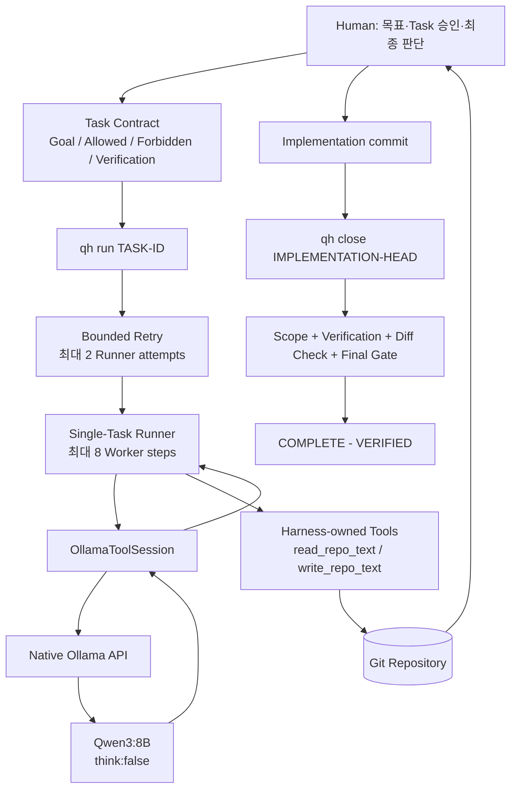

# Qwen Harness

로컬 Qwen LLM을 단순한 코드 생성기가 아니라, **Task Scope, 제한된 Tool 권한,
Git Evidence, Verification, Final Gate로 통제되는 검증 가능한 Coding Worker**로
사용하기 위한 local-first 개발 Harness입니다.

> 핵심 원칙: **LLM self-report != Evidence**

Qwen이 “수정했습니다” 또는 “테스트를 통과했습니다”라고 말하는 것만으로는
작업이 완료되지 않습니다. 실제 Git 변경 경로, 승인된 Verification 명령의
exit code, scope 판정과 Final Gate가 완료 근거입니다.

## 현재 상태 — 2026-08-23

현재 `main`은 **QH-V2-OPS-002 (`qh doctor`)까지 COMPLETE - VERIFIED** 상태입니다.
운영 상태의 최신 권위는 항상 [STATUS.md](STATUS.md)입니다.

| 영역 | 현재 상태 | 의미 |
|---|---|---|
| Harness Core | ✅ 완료 | Git baseline, ChangeScope, Verification, Evidence, Final Gate가 구현됨 |
| Native Ollama Worker | ✅ 완료 | 기본 `qwen3:8b` Worker 경로가 구현됨 |
| Repository Tools | ✅ 완료 | `read_repo_text`, scoped `write_repo_text` 제공 |
| Single-Task Runner | ✅ 완료 | 한 번에 현재 ACTIVE Task 하나만 실행 |
| Bounded Retry | ✅ 완료 | 무한 재시도 없이 `NORMAL` / `FAIL` / `BLOCKED`로 종료 |
| 실제 Qwen Repository E2E | ✅ 완료 | 실제 로컬 Ollama + Qwen으로 Repository 편집 흐름 검증 |
| Lifecycle / Evidence Hardening | ✅ 완료 | start/close, scope, verification, test-integrity 관련 hardening 반영 |
| `qh task-new` | ✅ OPS-001 완료 | Human-review Task 초안 생성 |
| `qh doctor` | ✅ OPS-002 완료 | Python/Git/Repository/Ollama/model 준비 상태 진단 |
| Windows `qh.cmd` | ⏳ OPS-003 예정 | 긴 `python tools\qh.py ...` 명령 단축 |
| Worker Test 표준화 | ⏳ OPS-004 예정 | Unit / Adapter / Live Smoke / Real E2E 구분 |
| `qh status` UX 개선 | ⏳ OPS-005 예정 | lifecycle/baseline/worktree 정보를 더 명확하게 표시 |
| STATUS 역사 분리 | ⏳ OPS-006 예정 | 현재 상태와 historical handoff를 분리 |
| Milestone 2 | ⏳ 설계 검토 예정 | Subtask Queue, model routing, LangGraph, multi-agent 등은 아직 미승인 |

OPS-002 구현 완료 commit은 `5a7157b`, lifecycle 완료 commit은 `9c4bbd3`입니다.
현재 `STATUS.md`는 다음 Task를 자동 선택하지 않고 Human 선택을 요구합니다.

## 이 프로젝트가 해결하려는 문제

작은 로컬 LLM은 코드를 작성할 수 있지만 다음을 안정적으로 보장하지 못합니다.

- 허용하지 않은 파일까지 수정하지 않았는가?
- 테스트를 실제로 실행했는가?
- 실패한 테스트를 숨기지 않았는가?
- 반복 실패에서 안전하게 멈췄는가?
- Repository 작업이 정말 완료되었는가?

Qwen Harness는 모델 자체를 무조건 신뢰하는 대신, 모델 바깥의 결정론적 Harness가
권한과 완료 판정을 소유하도록 설계했습니다.

```text
Human-approved Task Contract
        ↓
Qwen Worker
        ↓
Harness-owned Tool Boundary
        ↓
Git / Verification Evidence
        ↓
Deterministic Final Gate
```

## 한눈에 보는 구조



`qh run`이 `NORMAL`로 끝났다는 사실은 Repository Task PASS가 아닙니다.
최종 완료 판정은 `qh close <IMPLEMENTATION-HEAD>`가 수행하는 Git/Verification
Evidence와 Final Gate를 통해 이루어집니다.

## 실제로 검증된 환경

아래는 최소 사양이 아니라, 실제 Worker E2E가 성공한 한 가지 환경입니다.

| 항목 | 검증 환경 |
|---|---|
| 운영체제 | Windows |
| GPU | NVIDIA RTX 5070 Laptop GPU |
| VRAM | 8 GB |
| System RAM | 32 GB |
| 모델 런타임 | Ollama |
| 기본 모델 | `qwen3:8b` |
| 결과 | 실제 Repository Worker E2E 성공 |

다른 GPU, CPU-only, Linux/macOS 환경은 현재 동일 수준의 E2E Evidence가 없습니다.
8 GB VRAM을 최소 사양으로 해석하면 안 됩니다.

## 설치

### 1. Repository 복제

```powershell
git clone https://github.com/tmdgns104/qwen-harness-test.git
cd qwen-harness-test
```

### 2. 필수 프로그램 확인

```powershell
python --version
git --version
ollama --version
```

현재 소스는 Python 3.12 이상 문법을 사용하며, 주요 공개 검증은 Python 3.13.5에서
수행되었습니다. Git/Ollama 최소 버전은 별도로 고정하지 않습니다.

### 3. 기본 모델 준비

```powershell
ollama pull qwen3:8b
ollama list
```

`ollama list`에 `qwen3:8b`가 보이는지 확인하세요.

### 4. 설치 및 환경 진단

```powershell
python tools\qh.py doctor
```

`doctor`는 다음을 읽기 전용으로 확인합니다.

- Python runtime
- Git 사용 가능 여부
- Repository root
- Source-of-Truth 파일
- STATUS lifecycle 형태
- Current Task / ChangeScope / Verification 계약
- working tree
- Git remote
- Ollama endpoint
- 기본 모델 `qwen3:8b`

마지막 출력은 `OVERALL: PASS`, `OVERALL: WARN`, `OVERALL: FAIL` 중 하나입니다.
Dirty worktree나 optional remote 부재는 WARN일 수 있지만, 필수 Repository/Ollama
준비 실패는 FAIL입니다. `doctor`는 자동 복구, 모델 pull, remote 수정 등을 하지 않습니다.

### 5. 현재 Repository 상태 확인

```powershell
python tools\qh.py status
python tools\qh.py preflight
```

현재 `status`는 Current Task, 현재 HEAD 대비 worktree 변경 경로와 scope를 보여 줍니다.
더 풍부한 lifecycle/baseline 표시 UX는 OPS-005에서 개선할 예정입니다.

## 5분 시작 명령 모음

```powershell
git clone https://github.com/tmdgns104/qwen-harness-test.git
cd qwen-harness-test
python --version
git --version
ollama --version
ollama pull qwen3:8b
python tools\qh.py doctor
python tools\qh.py status
```

전체 첫 Task 실습은 [Quick Start](docs/QUICKSTART.md)를 따라 하세요.

## qh CLI

| 명령 | 목적 | 중요한 의미 |
|---|---|---|
| `python tools\qh.py doctor` | Python/Git/Repository/Ollama/model 진단 | 읽기 전용. PASS/WARN/FAIL을 구분 |
| `python tools\qh.py task-new <TASK-ID>` | Human-review Task 초안 생성 | 자동 승인/start/commit/close/push 하지 않음 |
| `python tools\qh.py status` | 현재 Task, worktree 변경 경로, scope 표시 | exit 0만 보고 clean이라고 판단하지 말 것 |
| `python tools\qh.py preflight` | Repository root, Task, scope 기본 점검 | dirty 여부는 보고하지만 별도 판단 필요 |
| `python tools\qh.py verify` | 현재 Task의 Verification만 실행 | scope/Final Gate 전체 검사는 아님 |
| `python tools\qh.py review [BASELINE]` | baseline 이후 scope + Verification + Final Gate 진단 | 정상 final path에서는 선택적 진단용 |
| `python tools\qh.py start <TASK-ID>` | 승인된 Task를 ACTIVE로 전환 | 현재 Task가 COMPLETE - VERIFIED, target이 정확히 승인 상태, worktree clean이어야 함 |
| `python tools\qh.py run <TASK-ID>` | Qwen Worker 실행 | `NORMAL`은 Task PASS가 아님 |
| `python tools\qh.py close <COMMIT>` | exact implementation HEAD로 authoritative close | full Verification + scope + Evidence + Final Gate 수행 |

## 새 Task를 만드는 방법

먼저 초안을 만듭니다.

```powershell
python tools\qh.py task-new QH-LOCAL-001
```

생성 상태는 정확히:

```text
DRAFT - HUMAN REVIEW REQUIRED
```

입니다. Human이 Goal, Architecture Basis, Allowed/Forbidden Changes,
Acceptance Criteria, Verification을 실제 작업에 맞게 작성하고 검토한 뒤에만:

```text
APPROVED - READY FOR CONTRACT BASELINE
```

으로 바꿉니다.

`task-new`는 **Task 파일 구조만 만들며**, Task를 승인하거나 시작하지 않습니다.

## 실제 Task 작업 흐름

```text
1. Problem / Goal 결정
2. Task 초안 작성
3. Human이 Scope / Verification 검토 및 승인
4. Task 계약 commit
5. clean working tree 확인
6. qh start TASK-ID
7. start lifecycle commit
8. qh run TASK-ID
9. git diff / status로 실제 변경 검토
10. 구현 commit
11. qh close IMPLEMENTATION_HEAD
12. Final Gate PASS 확인
13. lifecycle diff commit
14. 필요 시 push
```

중요한 점은 구현 중 `verify`/`review`를 매번 반복하지 않는 것입니다.
정상 final path에서는 `qh close`가 authoritative full Verification을 한 번 수행합니다.
Focused test는 개발 중 사용하고, full Verification은 close 단계에서 수행하는 것이 현재 운영 원칙입니다.

## `qh close`가 오래 걸릴 수 있는 이유

`qh close`는 단순 상태 변경 명령이 아닙니다. 현재 Task에 적힌 Verification을 실제로
실행하고, baseline 이후 changed paths, scope, `git diff --check`, Final Gate를 평가합니다.
Task에 Git fixture나 통합 테스트가 많으면 수분이 걸릴 수 있습니다.

현재 CLI는 child Verification이 실행되는 동안 긴 시간 출력이 없을 수 있습니다.
이는 알려진 운영 UX 마찰이며, 테스트가 실제로 실행 중일 수 있으므로 즉시 중단하기보다
Task의 Verification 비용을 먼저 확인하세요.

## Safety / Trust Model

- Qwen은 최종 PASS 권한이 없습니다.
- Qwen에게 일반 shell 또는 Git 권한을 주지 않습니다.
- LLM 요청 자체는 Tool 실행 권한이 아닙니다.
- Worker write는 Task Allowed/Forbidden ChangeScope를 통과해야 합니다.
- Forbidden이 Allowed보다 우선하고, 기본값은 deny입니다.
- 절대 경로와 Repository root 탈출은 거부합니다.
- Runner는 `STATUS.md`와 현재 Task lifecycle-control 파일 쓰기를 보호합니다.
- 한 Worker step의 다중/잘못된/알 수 없는 ToolRequest는 fail closed됩니다.
- Verification parser는 승인되지 않은 command 형태를 fail closed합니다.
- Retry는 유한하며, 쓰기 이후 위험한 재시도는 `BLOCKED`로 멈춥니다.
- `qh start`는 현재 lifecycle과 target Task approval을 검사하고 clean Git baseline을 요구합니다.
- `qh close`는 exact current HEAD가 아니면 완료하지 않습니다.
- 다음 Task는 자동 시작하지 않습니다.

## 현재 남은 계획

현재 Repository의 deterministic queue는 다음 순서입니다.

```text
OPS-003  Windows Workflow Simplification (`qh.cmd`)
   ↓
OPS-004  Worker Smoke / E2E Standardization
   ↓
OPS-005  qh status UX
   ↓
OPS-006  STATUS / Handoff Historical Cleanup
   ↓
M2-SPEC-001  Milestone 2 Specification & Architecture Review
   ↓
HUMAN ARCHITECTURE GATE
```

Milestone 2 후보인 LangGraph, Subtask Queue, expanded tools, shell authority,
additional local models, model routing, multiple agents, larger autonomous tasks,
Codex supervisor/fallback은 아직 구현 권한이 없습니다. M2-SPEC-001에서 먼저 분석하고
Human Architecture Gate를 통과해야 합니다.

## 현재 알려진 운영 마찰

- 일부 full Verification은 Git subprocess/fixture 때문에 오래 걸릴 수 있습니다.
- `qh close` 중 child test 진행 상황이 오래 표시되지 않을 수 있습니다.
- 과거 local `master`와 GitHub `main` 브랜치 이름 차이로 push 명령이 혼동된 사례가 있습니다.
- RED/GREEN source commit을 이미 local에 cherry-pick한 뒤 다시 적용하면 empty cherry-pick이 발생할 수 있습니다.

이 항목들은 현재 Final Gate 신뢰성 실패를 의미하지는 않지만, 운영 절차를 단순화하고
실제 프로젝트 사용 Evidence를 쌓으면서 계속 개선할 대상입니다.

## 브랜치 참고

GitHub 기본 브랜치는 `main`입니다. 새 clone은 보통 `main`을 추적합니다.
오래된 local clone이 `master`인 경우 `git push origin main`은 실패할 수 있습니다.
그 환경에서는 현재 branch를 확인한 뒤 명시적으로 refspec을 사용하세요.

예:

```powershell
git branch --show-current
git push origin master:main
```

브랜치 이름 자체를 변경하려면 작업 중인 Task와 Git 상태를 먼저 확인하고 별도 운영 결정으로
처리하세요.

## 문서

| 문서 | 역할 |
|---|---|
| [PROJECT.md](PROJECT.md) | 프로젝트 목적과 Milestone 1 경계 |
| [REQUIREMENTS.md](REQUIREMENTS.md) | 기능/검증 요구사항 |
| [DECISIONS.md](DECISIONS.md) | Accepted Architecture Decision Records |
| [STATUS.md](STATUS.md) | 현재 lifecycle 상태 |
| [BACKLOG.md](BACKLOG.md) | deterministic queue와 Human Gate |
| [tasks/](tasks/) | 각 Task 계약과 Evidence 요구사항 |
| [Quick Start](docs/QUICKSTART.md) | 처음 설치하고 첫 Task를 실행하는 절차 |
| [How It Works](docs/HOW_IT_WORKS.md) | 내부 구조와 신뢰 모델 |
| [Development Guide](docs/DEVELOPMENT.md) | Repository 개발 규칙 |
| [Verified Problem Resolutions](docs/verified_problem_resolutions.md) | 검증된 운영 문제와 해결 기록 |

현재 Repository에는 별도의 `ARCHITECTURE.md`와 `AGENTS.md`가 없습니다.
Architecture 권위는 Accepted `DECISIONS.md`와 Requirements/Task 계약에 있습니다.

## Source of Truth

Chat 기록이 아니라 Repository 문서와 Git Evidence를 프로젝트 상태의 권위로 사용합니다.
문서끼리 충돌하면 현재 `STATUS.md`, Accepted `DECISIONS.md`, `REQUIREMENTS.md`,
현재 Task 계약과 Git Evidence를 기준으로 판단합니다.

## License

현재 Repository에는 `LICENSE` 파일이 없습니다. 공개 열람은 가능하지만 제3자 재사용 조건을
명확히 하려면 별도의 Human 결정과 라이선스 추가 Task가 필요합니다.
