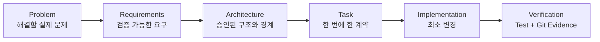
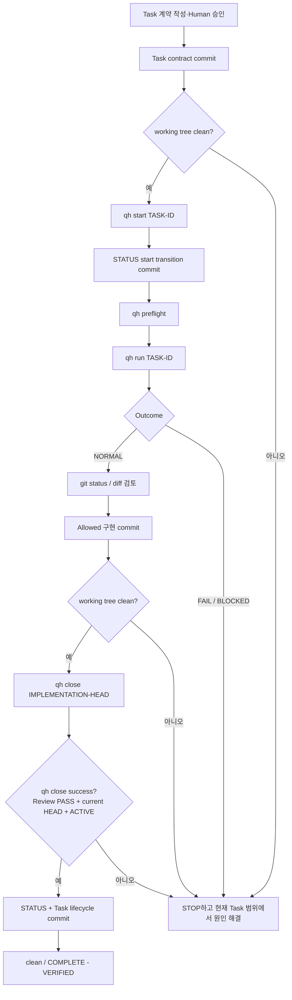

# Qwen Harness Development Guide

이 문서는 Qwen Harness 자체를 계속 개발할 때 지켜야 할 Repository 규칙을
설명합니다. 현재 구현을 바꾸는 모든 비단순 작업은 문서와 Task 계약에서
시작하며, 완료는 Evidence로 증명합니다.

## 기본 개발 순서



순서를 건너뛰어 코드부터 바꾸지 않습니다.

1. **Problem**: 무엇이 잘못되었고 누구에게 어떤 영향이 있는지 정의합니다.
2. **Requirements**: 완료 여부를 관찰 가능한 문장으로 바꿉니다.
3. **Architecture**: 기존 승인 결정으로 해결 가능한지 확인합니다.
4. **Task**: 작은 Goal과 변경 범위, Verification을 고정합니다.
5. **Implementation**: Task 안에서 필요한 최소 변경만 합니다.
6. **Verification**: 테스트, Git scope, Diff Check와 Final Gate로 증명합니다.

## Repository가 Source of Truth입니다

Chat 대화나 LLM의 기억은 공식 상태가 아닙니다. 작업 전에 다음 순서로
Repository 근거를 확인합니다.

1. [PROJECT.md](../PROJECT.md): 목적, 원칙, milestone 경계
2. [REQUIREMENTS.md](../REQUIREMENTS.md): 기능과 검증 요구사항
3. [DECISIONS.md](../DECISIONS.md): Accepted Architecture Decision Records
4. [STATUS.md](../STATUS.md): 상단 Current / Previous / Next Planned와 baseline
5. 현재 [Task 계약](../tasks/)
6. 관련 `tools/`, `tests/`와 Git history

이 Repository에는 현재 별도의 `ARCHITECTURE.md`와 tracked `AGENTS.md`가
없습니다. 없는 문서를 추측해 만들지 않습니다. 현재 Architecture의 권위 있는
기록은 `DECISIONS.md`의 Accepted ADR이며 PROJECT, REQUIREMENTS, Task, 코드와
테스트가 이를 보완합니다.

`STATUS.md`의 Handoff는 누적 이력을 포함하므로 오래된 `ACTIVE` 또는
`NOT STARTED` 문장만 떼어 현재 상태로 사용하지 않습니다. 상단 lifecycle
필드, 최신 완료 Task와 Git Evidence를 함께 봅니다.

## 한 번에 하나의 Task

새 구현 전에 `tasks/<TASK-ID>.md` 계약을 작성하고 Human 승인과 contract
baseline commit을 남깁니다. Task에는 최소한 다음이 있어야 합니다.

- Goal
- Scope
- Allowed Changes
- Forbidden Changes
- Acceptance Criteria
- Verification
- Stop Conditions

현재 ACTIVE Task만 수행합니다. 다른 기능을 발견해도 현재 Task에 섞지 않고
known issue 또는 다음 Task 후보로만 기록합니다. 다음 Task를 자동으로 만들거나
시작하지 않습니다.

`qh start`는 기존 Task 파일을 선택해 `STATUS.md`와 baseline을 바꿀 뿐입니다.
Task 생성, 계약 승인, clean 상태 강제 또는 commit을 대신하지 않습니다.
같은 ACTIVE Task의 duplicate start guard는 아직 구현되지 않았으므로 Human이
반복 실행을 피해야 합니다.

## Allowed / Forbidden 범위

Task scope는 Human이 모델과 구현자에게 위임한 변경 권한입니다.

지원 형식:

- 정확한 파일: `README.md`
- trailing recursive 경로: `docs/**`

지원하지 않는 예:

- `*.py`
- `tools/*.py`
- 중간 `**` 또는 다른 일반 glob

판정 원칙:

1. Forbidden match가 있으면 항상 거부합니다.
2. Forbidden이 아니고 Allowed match가 있어야 허용합니다.
3. 어느 Allowed에도 맞지 않으면 default deny입니다.
4. baseline 이후 실제 Git changed paths로 scope를 다시 검토합니다.

Worker write 경로에는 이 검사 외에도 Repository root confinement, 절대 경로와
`..` 거부, lifecycle-control 파일 보호가 적용됩니다. `read_repo_text`는
Repository root 안으로 제한되지만 Task의 쓰기 scope로 필터링되지는 않습니다.

## RED → GREEN

행동 변경 Task는 가능하면 실패하는 focused test로 문제를 먼저 재현합니다.

1. **RED**: 요구한 동작이 없어서 테스트가 예상대로 실패하는지 확인
2. **GREEN**: Task 범위의 최소 구현으로 focused test 통과
3. **Regression**: 관련 기존 테스트가 그대로 통과하는지 확인
4. **Evidence**: 실행 명령과 exit code를 Task와 STATUS에 기록

테스트를 삭제하거나 assertion을 약화해 GREEN을 만들지 않습니다. 현재 전체
discovery에는 아직 구현하지 않은 QH-V2-MD-001 RED fixture 때문에
`tests/test_markdown_append.py`의 알려진 실패 3개가 있습니다. 다른 Task가 이를
수정하지 않았다면 “전체 suite PASS”라고 주장하지 말고 focused regression과
Git non-regression Evidence를 정확히 기록합니다.

### unittest discovery 기준

Repository root에서 표준 unittest discovery를 확인할 때는 다음 두 명령을
사용합니다.

```powershell
python -m unittest discover
python -m unittest discover -s tests
```

두 명령은 동일한 Repository test tree를 발견해야 하며, root discovery가
0개를 반환하면 유효한 regression Evidence로 취급하지 않습니다. Discovery
구조 자체는 다음 meta-test로 검증합니다.

```powershell
python -m unittest tests.test_test_discovery
```

현재 전체 discovery에는 QH-V2-MD-001의 역사적 RED fixture 3개가
`tests/test_markdown_append.py`에 남아 있으므로, 위 full discovery 명령의
non-zero 종료를 새 Task regression과 혼동하지 않습니다. HARD-007과 같은
Task의 GREEN 완료 판정은 현재 Task 계약에 명시된 focused regression 명령과
Git non-regression Evidence를 사용하며, 알려진 3개 fixture를 수정하거나
skip해서 전체 suite를 GREEN으로 만들지 않습니다.

## Verification Contract 작성 규칙

`## Verification` 아래에서 인식되는 marker는 정확히 다음 세 가지입니다.

- `Run exactly:`
- `Run:`
- `Then run:`

marker 하나는 다음 중 하나만 허가합니다.

- standalone inline-code command 하나
- fenced block 하나이며 내부의 비어 있지 않은 command line이 정확히 하나

marker 없는 독립 command-looking inline code와 command fence, 명령이 없는
marker, 여러 command line 등 malformed contract는 fail closed합니다.
Verification은 shell 없이 argument vector로 실행되며 shell control token
`&&`, `||`, `|`, `;`를 허용하지 않습니다.

검증 명령은 check-only로 작성합니다. 현재 `qh review`는 Verification 실행
전에 changed paths를 수집하므로 Verification 자체가 Repository를 수정하는
명령이어서는 안 됩니다.

## Test Evidence와 Git Evidence

완료 보고에는 최소한 다음 근거가 필요합니다.

- Task의 모든 Verification command와 exit code
- focused regression test 결과
- baseline과 implementation commit
- baseline 이후 changed paths
- unexpected path가 없는지
- `git diff --check` 결과
- Final Gate 결과
- 최종 `git status --short`

Qwen 또는 Codex의 “PASS” 문장은 Evidence가 아닙니다. `NORMAL`도 Worker
interaction 종료 상태일 뿐 Repository PASS가 아닙니다.

Harness Core의 exact-content와 SHA-256 helper는 구현되어 있지만 현재
`qh review`가 Task Markdown에서 이를 자동 연결하지 않습니다. 필요한 invariant는
승인된 Verification command로 직접 검사합니다.

## 표준 Task lifecycle



명령 예:

```powershell
git status --short
python tools\qh.py start QH-V2-EXAMPLE-001
git diff -- STATUS.md
git add STATUS.md
git commit -m "start QH-V2-EXAMPLE-001"
git status --short
python tools\qh.py preflight
python tools\qh.py run QH-V2-EXAMPLE-001
git status --short
git diff

# 문제 진단이 필요할 때만 선택적으로 실행
# python tools\qh.py verify
# python tools\qh.py review

# 아래 예시 경로를 실제 Task의 Allowed 구현 경로로 바꾼 뒤 stage
git add -- path\to\allowed-file
git diff --cached
git commit -m "implement QH-V2-EXAMPLE-001"
git status --short

$implementationHead = git rev-parse HEAD
python tools\qh.py close $implementationHead
git diff -- STATUS.md tasks/QH-V2-EXAMPLE-001.md
git diff --check

# close가 만든 lifecycle 변경만 별도 commit
git add STATUS.md tasks/QH-V2-EXAMPLE-001.md
git diff --cached
git commit -m "mark QH-V2-EXAMPLE-001 complete"
git status --short
```

위 예시 ID는 설명용이며 해당 Task가 실제로 존재한다는 뜻이 아닙니다.
`review [BASELINE-COMMIT]`의 인자는 Task ID가 아니라 Git baseline입니다.
인자를 생략하면 `STATUS.md`에 저장된 Task Baseline을 사용합니다.
ADR-007의 표준 final path는 standalone verify/review를 필수로 반복하지 않고
`qh close`가 authoritative full Verification과 review를 한 번 실행하게 합니다.

## qh 명령의 책임 경계

| 명령 | 하는 일 | 하지 않는 일 |
|---|---|---|
| `status` | Current Task, working-tree 변경, scope 표시 | clean 또는 PASS 보장 |
| `preflight` | root, Task 파일과 scope 형식 검사 | dirty 상태 자체를 실패 처리 |
| `verify` | 현재 Task Verification command 실행 | changed-path scope와 Final Gate 평가 |
| `review` | changed paths, Verification, Evidence, Final Gate와 Diff Check | commit 또는 lifecycle 변경 |
| `start` | 기존 Task를 Current로 지정하고 baseline 기록 | Task 생성·승인·commit·clean 강제 |
| `run` | Runner와 bounded Retry 실행 | verify·review·commit·close |
| `close` | review 후 인자 commit이 현재 HEAD인지 확인하고 lifecycle 변경 | lifecycle commit 생성 |

## Architecture 변경 절차

현재 Task가 승인된 Architecture 안에서 해결되지 않으면 구현을 넓히지 않습니다.
다음 형식으로 중단합니다.

```text
DESIGN CHANGE REQUIRED

- current design
- blocking problem
- proposed change
- alternatives considered
- affected files/interfaces
- risks and migration impact
```

Human이 Architecture 변경을 승인하고 `DECISIONS.md`의 새 ADR 또는 기존 결정
변경이 정식 Task로 반영되기 전에는 구현하지 않습니다. Requirements나
Architecture를 편의상 현재 기능 Task에 섞어 수정하지 않습니다.

## 완료 체크리스트

- [ ] Repository Source of Truth와 current Task를 다시 읽었다.
- [ ] 한 Task만 수행했고 Architecture를 바꾸지 않았다.
- [ ] changed paths가 Allowed 안에 있고 Forbidden과 겹치지 않는다.
- [ ] RED 테스트를 삭제하거나 약화하지 않았다.
- [ ] 모든 Task Verification command가 exit 0이다.
- [ ] focused regression과 알려진 기존 failure를 구분했다.
- [ ] `Unexpected Changed Paths: no`를 확인했다.
- [ ] `Diff Check: exit 0`과 `Final Gate: PASS`를 확인했다.
- [ ] implementation commit이 실제 current HEAD였다.
- [ ] close가 만든 lifecycle 변경을 별도 commit했다.
- [ ] 최종 working tree가 clean이다.
- [ ] 다음 Task를 자동으로 시작하지 않았다.

처음 사용하는 방법은 [Quick Start](QUICKSTART.md), 내부 역할과 신뢰 모델은
[How It Works](HOW_IT_WORKS.md)를 참고하세요.

## 원격 작업 인계 표준

QH-V2-OPS-GIT-001부터 ChatGPT/GitHub에서 만든 변경을 로컬로 가져올 때는
multi-commit range `cherry-pick`을 일상 정상 경로로 사용하지 않습니다.

정상 절차는 다음과 같습니다.

```text
정확한 local HEAD baseline 기록
  -> 그 SHA에서 원격 작업 브랜치 생성
  -> 정확히 하나의 atomic handoff commit 생성
  -> git fetch
  -> python tools\qh.py handoff-check <remote-ref>
  -> FAST_FORWARD_SAFE 확인
  -> git merge --ff-only <remote-ref>
```

`handoff-check`는 read-only입니다. fetch, merge, cherry-pick, reset, rebase,
push, branch 삭제 또는 conflict resolution을 실행하지 않습니다.

다음 classification을 구분합니다.

- `FAST_FORWARD_SAFE`: 현재 Local HEAD가 handoff commit의 정확한 parent입니다.
- `ALREADY_APPLIED_EXACT`: 현재 HEAD가 handoff commit과 정확히 같습니다.
- `ALREADY_CONTAINED`: handoff commit이 이미 현재 HEAD history에 포함됩니다.
- `STOP_DIRTY`: worktree/index가 clean하지 않습니다.
- `STOP_NON_ATOMIC_OR_DIVERGED`: direct-parent 단일 commit 계약과 맞지 않거나 history가 갈라졌습니다.

`FAST_FORWARD_SAFE`가 아니면 임의 merge/rebase/reset으로 맞추지 않습니다.
특히 반복 `git cherry-pick --skip`을 정상 복구 절차로 사용하지 않고 STOP한 뒤
exact baseline에서 handoff를 다시 만들거나 별도 Human-reviewed integration을 선택합니다.
