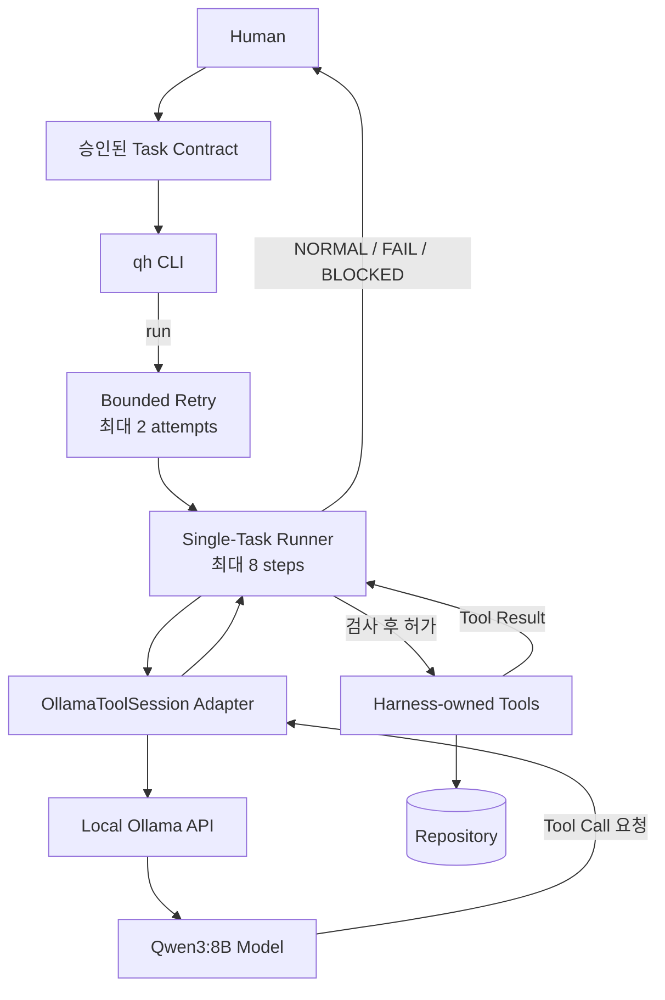
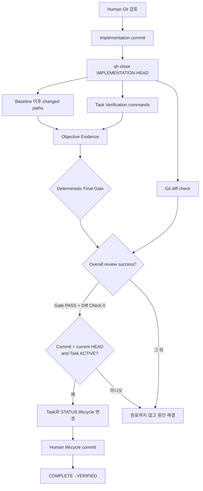
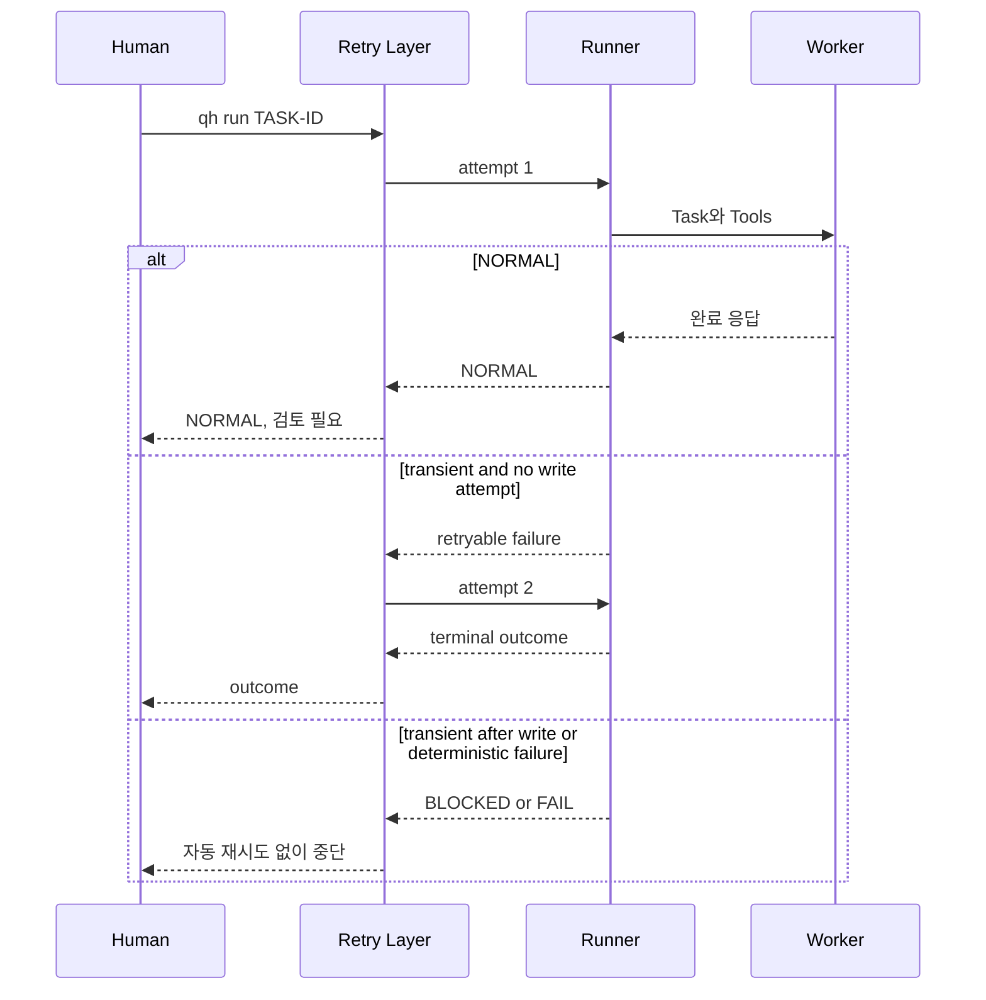

# Qwen Harness는 어떻게 동작하나요?

Qwen Harness는 “모델이 코드를 생성하는 과정”과 “Repository 작업이 실제로
완료되었는지 판정하는 과정”을 분리합니다. 모델의 말이 아니라 Harness와 Git이
수집한 Evidence가 완료 권한을 가집니다.

> **LLM self-report != Evidence**

## 한눈에 보는 구조

이 그림에서 Qwen은 Repository에 직접 연결되지 않습니다. Qwen은 요청만 만들고,
Runner와 Repository Tool이 그 요청을 검사한 뒤 실행 여부를 결정합니다.

완료 판정은 별도의 흐름입니다.

## Qwen은 무엇인가요?

Qwen은 입력을 이해하고 텍스트 또는 Tool Call을 생성하는 LLM입니다. 이
Repository의 기본 모델은 `qwen3:8b`입니다. 모델은 무엇을 바꿀지 추론할 수
있지만 다음 권한은 없습니다.

- 일반 shell 실행
- Git 명령 실행 또는 commit
- Verification과 Final Gate 실행
- Task scope, retry budget 또는 lifecycle 결정
- Repository Task의 최종 PASS 선언

모델이 출력한 `PASS`는 단지 모델 텍스트입니다.

## Ollama는 무엇인가요?

Ollama는 로컬 컴퓨터에서 Qwen 모델을 실행하고 HTTP API로 제공하는 런타임입니다.
Harness의 native adapter는 기본적으로 `http://127.0.0.1:11434/api/chat`에
요청하며 모델 `qwen3:8b`와 `think:false`를 사용합니다.

Ollama는 모델을 제공하지만 Task scope나 Git Evidence를 관리하지 않습니다.
Repository 안전 정책은 Harness가 담당합니다.

## Harness는 무엇인가요?

Harness는 Human이 승인한 Task와 Qwen 사이에 있는 결정론적 Python 계층입니다.
주요 책임은 다음과 같습니다.

- Worker에게 보여 줄 Tool schema 정의
- Tool Call 구조와 step 수 검사
- 쓰기 경로의 Allowed/Forbidden scope 적용
- baseline 이후 Git changed paths 수집
- 명시된 Verification 명령 실행
- Evidence 조립과 Final Gate 판정
- 안전한 경우에만 제한적으로 retry

Qwen이 “무엇을 할지” 추론한다면 Harness는 “무엇이 허용되고 무엇이
증명되었는지” 검사합니다.

## Model과 Agent는 어떻게 다른가요?

Model은 Qwen 자체입니다. 입력을 받아 다음 출력을 예측합니다.

Agent 또는 Worker 경로는 Model에 목표, Tool, 반복 규칙과 중단 조건을 붙인
실행 시스템입니다. 이 프로젝트에서 Qwen만으로는 Agent가 아닙니다.
Adapter, Runner, Retry, Repository Tools와 Task Contract가 함께 Worker 경로를
만듭니다.

## Worker란 무엇인가요?

Worker는 현재 ACTIVE Task를 수행하도록 제한된 Qwen 실행 역할입니다.
`qh run <TASK-ID>`이 이 경로를 시작합니다. Worker는 Task를 읽고 Tool Call을
요청할 수 있지만 Repository 도구를 직접 소유하지 않습니다.

Worker interaction의 결과는 다음 중 하나입니다.

| 결과 | 의미 |
|---|---|
| `NORMAL` | 상호작용이 정상 종료됨. Repository PASS가 아님 |
| `FAIL` | 안전 위반, 구조 오류, 알 수 없는 분류 또는 step budget 등 결정론적 실패 |
| `BLOCKED` | transient 실패가 안전하게 해결되지 않았거나 쓰기 시도 뒤 문제가 발생 |

## Adapter란 무엇인가요?

`OllamaToolSession` Adapter는 Ollama의 request/response 형식과 Harness의
backend-neutral Worker 계약 사이를 변환합니다. Qwen의 Tool Call을
`ToolRequest`로 바꾸고, 실행 결과를 `ToolResult`로 다시 모델에 전달합니다.

Adapter를 둔 이유는 Ollama 통신 세부사항과 Harness Core의 안전 규칙을 섞지
않기 위해서입니다. 그렇다고 다른 backend가 현재 모두 구현되어 있다는 뜻은
아닙니다.

## Runner란 무엇인가요?

Runner는 한 Task의 Tool loop를 소유합니다. 현재 구현은 다음을 강제합니다.

- `STATUS.md`에 기록된 ACTIVE Task만 실행
- 한 Worker step에서 Tool Call 0개 또는 1개만 허용
- 최대 8 Worker step
- 알려진 Tool 이름과 argument 구조 검사
- 절대 경로와 `..` 경로 탈출 거부
- Worker가 lifecycle-control 파일인 `STATUS.md`와 현재 Task 파일을 쓰지 못하게 보호
- 실제 ToolResult를 다음 모델 요청에 연결

모호하거나 잘못된 요청은 넓게 해석하지 않고 fail closed합니다.

## Tool Call은 무엇인가요?

Tool Call은 Qwen이 “이 도구를 이 argument로 실행해 달라”고 보내는 구조화된
요청입니다. 요청 자체는 권한이 아닙니다.

현재 Worker에게 노출되는 도구는 두 개입니다.

- `read_repo_text`: Repository root 안의 UTF-8 파일 읽기
- `write_repo_text`: scope가 허용한 Repository 경로에 UTF-8 쓰기

읽기는 Repository root 밖으로 나갈 수 없지만 Task의 Allowed/Forbidden
쓰기 scope로 필터링되지는 않습니다. 쓰기는 forbidden-first, default-deny
검사를 통과해야 합니다.

## 왜 Qwen에게 shell 권한을 직접 주지 않나요?

일반 shell은 파일 변경, 프로세스 실행, 네트워크 접근 등 매우 넓은 권한을
한 번에 제공합니다. 모델이 잘못된 명령을 만들면 Task scope만으로 통제하기
어렵습니다.

이 프로젝트는 Worker의 Tool 표면을 Repository 읽기와 제한된 쓰기로 줄입니다.
Git과 Verification은 Human이 호출하는 `qh` 경로가 담당합니다. 따라서 모델은
테스트를 실행했다고 가장하거나 Git 이력을 바꿀 권한을 얻지 않습니다.

## Allowed / Forbidden은 무엇인가요?

각 Task 계약은 변경 가능한 경로와 금지 경로를 선언합니다.

- exact path 예: `tools/example.py`
- trailing recursive path 예: `docs/**`
- `*.py` 같은 일반 glob은 지원하지 않음
- Forbidden이 Allowed보다 항상 우선
- 어떤 Allowed에도 맞지 않으면 기본 거부

예를 들어 Allowed가 `docs/**`여도 Forbidden에 `docs/private.md`가 있으면
해당 파일은 쓸 수 없습니다. Runner가 허용했더라도 Final Gate는 baseline 이후
실제 Git changed paths를 다시 검사합니다.

## Git Evidence는 왜 필요한가요?

모델의 대답만 보면 어떤 파일이 실제로 바뀌었는지 알 수 없습니다. Harness는
Task 시작 시 저장한 Git baseline과 현재 상태를 비교해 changed paths를
수집합니다.

Git Evidence로 다음 질문에 답할 수 있습니다.

- 어떤 경로가 추가·수정·삭제되었는가?
- 모든 경로가 Allowed 안에 있는가?
- Forbidden 또는 예상 밖 경로가 있는가?
- 구현 commit과 lifecycle 기록이 어떤 순서로 남았는가?

`git diff --check`는 별도로 whitespace 오류도 검사합니다.

## Verification은 왜 필요한가요?

변경 경로가 올바르더라도 결과가 요구사항을 만족한다는 보장은 없습니다.
Task의 `## Verification`에는 Human이 승인한 실제 검사 명령을 명시합니다.

허용 marker는 정확히 다음 세 가지입니다.

- `Run exactly:`
- `Run:`
- `Then run:`

marker 하나에는 standalone inline-code 명령 하나 또는 비어 있지 않은 한 줄짜리
fenced command block 하나만 연결할 수 있습니다. marker 없는 독립 command,
여러 줄 fence, 빠진 명령과 모호한 형식은 fail closed합니다. `&&`, `||`,
`|`, `;` 같은 shell control token도 허용하지 않습니다.

문자 `;`가 인용된 `python -c` 코드 안에 있는 기존 Task 명령과 shell control
연산자를 혼동하면 안 됩니다. Harness는 command를 argument 단위로 파싱해
shell 없이 실행합니다.

## Evidence란 무엇인가요?

Evidence는 검토자가 다시 확인할 수 있는 객관적 결과입니다.

- Task baseline commit
- baseline 이후 changed paths
- 각 경로의 scope 판정
- 실행한 Verification command
- command별 exit code와 출력
- Diff Check 결과

Harness Core에는 exact-content와 SHA-256 검사 함수도 있습니다. 그러나 현재
`qh review`는 Task Markdown에서 이 invariant를 자동 추출해 연결하지 않습니다.
필요한 content/hash 검사는 Task Verification 명령으로 명시해야 합니다.

## Final Gate란 무엇인가요?

Final Gate는 조립된 Evidence를 결정론적으로 평가합니다. LLM의 의견을 다시
묻는 단계가 아닙니다.

`qh review`는 scope, Verification, Evidence와 Final Gate를 평가하고 별도
Diff Check도 보여 줍니다. `qh close <COMMIT>`은 review가 성공하고 인자로 받은
commit이 현재 HEAD일 때만 lifecycle 파일을 변경합니다. close 자체는 commit을
만들지 않습니다.

최종 검토에서는 최소한 다음을 직접 확인합니다.

- 모든 Verification exit code가 0
- `Unexpected Changed Paths: no`
- `Diff Check: exit 0`
- `Final Gate: PASS`

## Retry는 언제 하나요?

Retry Layer는 전체 Runner attempt를 최대 2회로 제한합니다. 첫 attempt의
transient Worker 오류가 쓰기 시도 전에 발생한 경우에만 한 번 더 시도할 수
있습니다.

다음 경우에는 넓은 자동 retry를 하지 않습니다.

- 안전 위반이나 잘못된 Tool Call 같은 deterministic failure
- Worker가 이미 쓰기를 시도한 뒤 발생한 transient failure
- 알 수 없는 outcome

이미 변경된 Repository를 모르고 다시 실행하는 위험을 줄이기 위한 규칙입니다.

## 왜 Qwen의 PASS를 믿지 않나요?

Qwen을 불신해서가 아니라 역할을 분리하기 위해서입니다. 언어 모델은 유용한
추론과 제안을 담당하고, 사실 확인은 Git과 실제 프로세스 exit code가 담당합니다.
이렇게 해야 모델이 바뀌거나 같은 요청의 답이 달라져도 완료 기준은 유지됩니다.

현재 구현 상태와 Planned 항목은 [README](../README.md)와
[STATUS.md](../STATUS.md), Architecture 결정은
[DECISIONS.md](../DECISIONS.md)에서 확인하세요.
